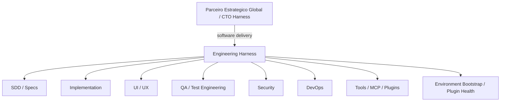

# Engineering Harness

Conjunto de plugins e skills para orquestrar engenharia de software como um **Engineering Harness**: diagnosticar demandas, fechar escopo, gerar specs, resolver capacidades, executar trabalho especializado, preservar handoffs, validar resultados e controlar gates de entrega.

O repositorio continua chamado `Dev-workflow` por compatibilidade, mas o papel central do `dev-workflow-standard` mudou. Ele nao e mais apenas um organizador/distribuidor de tasks; agora funciona como o **harness de engenharia**, responsavel por transformar planejamento em execucao verificavel sem substituir as regras locais, o PRD, a arquitetura existente ou a aprovacao humana.

## Indice

- [Plugins](#plugins) e [arquitetura](#arquitetura-do-engineering-harness)
- [Engineering Harness](#dev-workflow-standard-engineering-harness)
- [Relatorios humanos](#human-execution-reporting) e [tools por skill](#skill-owned-tool-registry)
- [UI/UX](#uiux-standard), [Security](#security-standard) e [SDD](#sdd-spec-factory)
- [Implementation](#dev-implementation-standard) e [DevOps](#devops-standard)
- [Setores e Context Routing](#setores-e-context-routing) e [QA independente](#qa-testing-standard)
- [Instalacao](#instalacao), [compatibilidade](#compatibilidade) e [uso](#uso-recomendado)

## Camada Global

O repositorio tambem inclui o `parceiro-estrategico-global`, uma camada geral e opcional acima dos fluxos especializados. Ela nao mantem um catalogo fixo de plugins. Em cada demanda, identifica a capacidade necessaria, verifica o que realmente esta disponivel no runtime e roteia para a skill, plugin, conector, MCP, ferramenta ou agente mais adequado.

Quando a demanda for desenvolvimento de software, o fluxo pode seguir:

```text
Usuario
  -> parceiro-estrategico-global
  -> identifica dominio/capacidade
  -> dev-workflow-standard (Engineering Harness)
  -> specialists / tools / executors
```

Se nao houver capacidade adequada, a camada global primeiro procura uma opcao existente e consolidada; somente depois propoe instalar, conectar, criar ou evoluir uma capacidade reutilizavel. Ela nao absorve as responsabilidades do Engineering Harness nem das skills especialistas.

Fluxo essencial:

```text
demanda
  -> Engineering Harness
  -> Human Task + lean Execution Contract
  -> bootstrap curto (task_id + execution_contract_path)
  -> capability routing
  -> skills / tools / executors
  -> execucao real
  -> evidencia
  -> validacao
  -> conclusao ou rework
```

O Human Task permanece legivel para acompanhamento, decisao e status. O
Execution Contract em `docs/execution/TASK-XXX.json` e o indice operacional
enxuto: aponta para escopo, criterios, testes, skills e fontes obrigatorias. O
executor valida esse JSON primeiro e carrega specs, docs e codigo sob demanda.
O `EXECUTION_RECEIPT` so nasce depois da execucao, a partir de evidencia
observada, e nao e entrada do proprio checkpoint. O
`EXECUTION_REPORT_COMMENT` traduz checkpoints materiais em um diario humano
curto na Issue vinculada, sem substituir task, receipt, Project ou PR.

Regra de manutencao: toda alteracao de arquitetura, workflow, contrato
operacional, instalacao ou uso publico deve atualizar este README no mesmo
conjunto de mudancas. Alteracoes internas sem impacto documentavel devem ao
menos confirmar explicitamente que o README continua correto.

README desatualizado para mudancas de skills, capabilities, tools, estados ou
gates significa `NOT READY TO COMMIT`.

Praticas consolidadas sustentam o repositorio como fonte de verdade, progressive
disclosure, uso de ferramentas reais, feedback loops e validacao mecanica. A
separacao em skills independentes, os gates humanos e os nomes `EXECUTION_RECEIPT`,
`EXECUTION_REPORT_COMMENT`, `SKILL_RECEIPT`, `REUSE_INVENTORY`,
`MINIMAL_CODE_GATE` e `EXECUTION_HANDOFF` sao decisoes ou extensoes locais
deste projeto, nao padroes oficiais da OpenAI. A classificacao completa esta em
[`docs/engineering-harness-audit.md`](docs/engineering-harness-audit.md).

## Plugins

```text
plugins/
  qa-testing-standard/
    .codex-plugin/plugin.json
    .claude-plugin/plugin.json
    plugin.json
    skills/qa-testing-standard/SKILL.md
    skills/qa-testing-standard/references/
  dev-environment-standard/
    .codex-plugin/plugin.json
    .claude-plugin/plugin.json
    plugin.json
    skills/dev-environment-standard/SKILL.md
    skills/dev-environment-standard/scripts/environment.py
  devops-standard/
    .codex-plugin/plugin.json
    .claude-plugin/plugin.json
    plugin.json
    THIRD_PARTY_NOTICES.md
    skills/devops-standard/SKILL.md
    skills/devops-standard/references/
    skills/devops-standard/templates/
  parceiro-estrategico-global/
    .codex-plugin/plugin.json
    .claude-plugin/plugin.json
    plugin.json
    skills/parceiro-estrategico-global/SKILL.md
  dev-workflow-standard/
    .codex-plugin/plugin.json
    .claude-plugin/plugin.json
    plugin.json
    skills/dev-workflow-standard/SKILL.md
  ui-ux-standard/
    .codex-plugin/plugin.json
    .claude-plugin/plugin.json
    plugin.json
    skills/ui-ux-standard/SKILL.md
  security-standard/
    .codex-plugin/plugin.json
    .claude-plugin/plugin.json
    plugin.json
    skills/security-standard/SKILL.md
  sdd-spec-factory/
    .codex-plugin/plugin.json
    .claude-plugin/plugin.json
    plugin.json
    skills/sdd-spec-factory/SKILL.md
    templates/
  dev-implementation-standard/
    .codex-plugin/plugin.json
    .claude-plugin/plugin.json
    plugin.json
    skills/dev-implementation-standard/SKILL.md
    templates/
```

Cada plugin mantem uma unica skill canonica e manifestos adaptadores para
Codex, Claude Code e Antigravity. Isso evita que as regras das tres plataformas
evoluam de forma diferente.

## Arquitetura do Engineering Harness

As skills continuam independentes. O `dev-workflow-standard` atua como control plane de engenharia: resolve a capacidade necessaria, verifica disponibilidade, invoca o executor ou especialista, acompanha o estado da execucao e valida o resultado antes de liberar o proximo gate.

```text
Global / caller
      |
      v
parceiro-estrategico-global
      |
      | software delivery
strategy / architecture / stack / cost / risk
      |
      v
dev-workflow-standard
Engineering Harness
      |
      +--> dev-environment-standard (bootstrap / health)
      +--> sdd-spec-factory
      +--> dev-implementation-standard
      +--> ui-ux-standard
      +--> qa-testing-standard
      +--> security-standard
      +--> devops-standard
      +--> plugins / MCPs / CLIs / scripts / executor LLM
                     |
                     v
              EXECUTION_RECEIPT
                     |
                     v
                 VALIDATION
                     |
                     v
                 COMPLETED
```

As skills especialistas nao foram absorvidas nem descartadas. O harness coordena e valida; cada skill continua dona de sua especialidade.

### Visao rapida da hierarquia



O `parceiro-estrategico-global` exerce a camada Global/CTO: decide dominio,
estrategia tecnica, build vs buy, arquitetura macro, stack, infraestrutura,
custo e risco. O `Engineering Harness` recebe essa direcao para software e
decide como o trabalho sera especificado, executado e validado. Essa separacao
hierarquica e uma decisao arquitetural local deste projeto.


| Skill | Papel |
| --- | --- |
| `parceiro-estrategico-global` | Camada global: descoberta, verificacao e roteamento dinamico de capacidades |
| `dev-workflow-standard` | Engineering Harness / revisor final |
| `dev-environment-standard` | Bootstrap portatil, preparacao seletiva e Plugin Health |
| `sdd-spec-factory` | LLM de requisitos: specs, Human Task e Execution Contract |
| `dev-implementation-standard` | Agente executor / coder |
| `ui-ux-standard` | LLM especialista em UI/UX |
| `qa-testing-standard` | QA funcional independente, reproducao, regressao e reteste |
| `security-standard` | LLM especialista em seguranca |
| `devops-standard` | Especialista em CI/CD, infraestrutura, operacoes, releases e recuperacao |

Pipeline de ponta a ponta:

```text
Ideia / demanda
  -> dev-workflow-standard diagnostica (perguntas criticas, riscos)
  -> dev-workflow-standard consolida escopo
  -> sdd-spec-factory gera specs
  -> sdd-spec-factory gera Human Task + lean Execution Contract
  -> matriz de setores e Context Routing com fontes/propositos
  -> aprovacao humana
  -> executor recebe task_id + execution_contract_path
  -> contrato validado; referencias obrigatorias carregadas sob demanda
  -> skills obrigatorias carregadas + SKILL_RECEIPT
  -> capability registry resolve executor/especialistas
  -> disponibilidade do runtime e verificada
  -> capacidade selecionada e invocada; estado RUNNING
  -> REUSE_INVENTORY + MINIMAL_CODE_GATE
  -> dev-implementation-standard implementa (somente o escopo da task)
  -> resultado inspecionavel: diff / arquivos / comandos / artefatos
  -> TASK.md atualizada
  -> EXECUTION_RECEIPT completo
  -> EXECUTION_REPORT_COMMENT -> GitHub Issue / historico do Board
  -> dev-workflow-standard entra em VALIDATING
  -> ui-ux-standard / qa-testing-standard / security-standard / DevOps conforme REQUIRED
  -> reconciliacao dos setores e gate do PR
  -> Pull Request quando autorizado
  -> gate final do Harness e review humano
  -> dev-workflow-standard aprova ou solicita rework
  -> merge / deploy (somente apos PR aprovado)
```

Regras invariantes:

- `dev-workflow-standard` nunca escreve codigo de produto e nunca pula o
  contrato de intencao proporcional a complexidade da mudanca.
- `dev-implementation-standard` nunca implementa sem task aprovada e nunca altera
  fora do escopo sem registrar justificativa.
- `ui-ux-standard` e obrigatoria quando houver UI.
- `security-standard` e obrigatoria quando houver auth, autorizacao, tokens,
  sessao, dados sensiveis, uploads, pagamentos ou integracoes externas.
- Toda task aponta para specs obrigatorias.
- Todo PR aponta para task, issue, branch e specs seguidas.
- Skill mencionada nao e skill aplicada: toda skill obrigatoria gera `SKILL_RECEIPT`.
- Task atribuida nao e task executada: toda delegacao real gera `EXECUTION_RECEIPT`.
- Comentario humano nao e evidencia de execucao: ele resume checkpoints
  materiais e so conta como publicado quando a operacao retorna URL/identificador.
- `ASSIGNED` nunca equivale a `COMPLETED`; conclusao exige resultado inspecionavel e evidencia de validacao.
- Nenhum novo codigo e aceito sem `REUSE_INVENTORY` e `MINIMAL_CODE_GATE`.
- Se um LLM ficar sem tokens ou indisponivel, outro assume pelo `EXECUTION_HANDOFF`.
- Nenhum deploy e aprovado sem PR aprovado.

O pipeline completo, com gates e gatilhos, esta em
[`docs/workflow-pipeline.md`](docs/workflow-pipeline.md).

## Dev Workflow Standard: Engineering Harness

Skill central do harness de engenharia. E a unica responsavel por aprovar a passagem de um gate para o proximo e nunca escreve codigo de produto diretamente.

O ponto principal da refatoracao e simples: **delegar nao significa apenas atribuir uma task ou citar o nome de uma skill**. O harness so considera uma delegacao executada quando a capacidade selecionada realmente roda, produz resultado inspecionavel e retorna evidencia suficiente para validacao.

Responsabilidades:

- Receber a demanda, diagnosticar e fazer as perguntas criticas.
- Consolidar escopo (incluido, fora de escopo, restricoes, riscos, decisoes).
- Decidir quais skills, plugins, tools, MCPs, scripts ou executores usar.
- Resolver a capacidade preferencial e um fallback seguro quando aplicavel.
- Verificar se a capacidade existe e esta disponivel no runtime atual.
- Exigir specs antes de tasks e tasks antes da implementacao.
- Invocar a criacao de specs via `sdd-spec-factory`.
- Invocar a implementacao via `dev-implementation-standard` ou executor explicitamente aprovado.
- Exigir `EXECUTION_RECEIPT` antes de tratar uma delegacao como executada.
- Repetir, trocar executor, fazer handoff, replanejar ou bloquear quando a execucao falhar.
- Acionar `ui-ux-standard` quando houver UI.
- Acionar `security-standard` quando houver auth, autorizacao, tokens, sessao,
  dados sensiveis, uploads, pagamentos ou integracoes externas.
- Revisar o PR contra specs, task e criterios de aceite.
- Aprovar ou solicitar rework; relatar status por Banco, API/Backend e Frontend/UI.
- Nunca implementar codigo de produto diretamente.

Essa separacao entre orquestracao e escrita de codigo de produto e uma decisao
arquitetural local. Ela preserva isolamento de responsabilidade, handoff e
revisao independente; nao e apresentada como regra universal de Harness
Engineering.

### Profundidade proporcional

- `TRIVIAL`: mudanca localizada e de baixo risco; contrato inline com escopo,
  criterio de aceite, validacao e evidencia.
- `NORMAL`: Issue/task concisa e docs existentes; spec focada somente quando o
  comportamento ainda nao estiver especificado.
- `COMPLEX`: SDD duravel, task executavel, rastreabilidade e especialistas
  aplicaveis.

O nivel de documentacao muda; validacao, seguranca, UI e evidencias nao sao
dispensadas quando a superficie afetada exigir esses gates.

### Papel do Engineering Harness

O `dev-workflow-standard` administra o ciclo de ponta a ponta como **Engineering Harness**. Ele conduz descoberta, escopo, planejamento, roteamento de capacidades, execucao, handoff, validacao, recovery/replan, gates e aprovacao, mas nao absorve as responsabilidades das skills especialistas. A criacao de specs e da task fica com
`sdd-spec-factory`; a implementacao fica com o agente executor usando
`dev-implementation-standard`. O orquestrador divide o trabalho,
controla escopo, revisa cada diff/PR e executa a validacao final.

O orquestrador nunca escreve codigo de produto. Depois que as specs e a task
estao aprovadas, ele delega a implementacao para `dev-implementation-standard`,
que pode usar qualquer LLM autorizado como meio de execucao. Para economizar
contexto e tokens, o orquestrador nao envia o projeto inteiro nem a conversa
completa: cada delegacao recebe identificadores, setor e revisao. O contrato
aponta as secoes da Task, as specs obrigatorias relevantes, o modulo
permitido, restricoes e os criterios de aceite. Banco, API/Backend, Frontend/UI,
testes e documentacao sao separados quando puderem ser revisados de forma
independente.

Quando Claude Code for o transporte escolhido, o agente orquestrador verifica
`claude --version` e `claude auth status` e registra `CLAUDE_STATUS`. Se esse LLM
ficar sem tokens, contexto, autenticacao ou rede, o estado e persistido em
`EXECUTION_HANDOFF` e outro LLM autorizado continua a mesma task sem reiniciar
ou duplicar a implementacao. O adaptador de terminal visivel esta em
[`claude-delegation.md`](plugins/dev-workflow-standard/skills/dev-workflow-standard/references/claude-delegation.md).

Esse transporte e apenas o meio de execucao do `dev-implementation-standard`; a
divisao do trabalho, o controle de escopo e a revisao de cada diff/PR continuam
com o orquestrador.

### Estado de execucao do Harness

Cada checkpoint executavel usa estados explicitos:

```text
PENDING -> READY -> RUNNING -> VALIDATING -> COMPLETED
                         |          |
                         |          +-> REWORK -> READY
                         +-> BLOCKED / REPLAN
```

Regras:

- `PENDING`: pre-condicoes ainda incompletas.
- `READY`: task, specs, escopo e capacidade resolvidos.
- `RUNNING`: a capacidade foi realmente invocada.
- `VALIDATING`: o resultado retornou e esta sendo validado.
- `REWORK`: a execucao aconteceu, mas falhou nos criterios de aceite.
- `BLOCKED`: nenhuma rota segura consegue continuar.
- `COMPLETED`: existe resultado + evidencia de validacao.

`ASSIGNED` nao e estado de conclusao.

## Setores e Context Routing

A Human Task e o painel completo; o Harness le essa visao global e reconcilia
os setores. Cada especialista recebe `task_id`, `execution_contract_path`,
`sector`, revisao e receipts de dependencias materiais, nao corpos inteiros de
Tasks/specs. O contrato e indice, nao armazena status, logs ou resultados.

A Sector Validation Matrix mantem Banco, API/Backend, Frontend, UI/UX, QA/Testes,
Seguranca, DevOps/Infraestrutura, Observabilidade, Documentacao e Gate Final.
Cada linha tem owner, REQUIRED ou N/A, motivo de N/A, estado e dependencias.
Dominio adicional material pode ser incluido. Uma Task trivial usa matriz
compacta, sem secoes detalhadas ou invocacoes para os setores N/A.

- REQUIRED: carregar path e proposito antes da acao.
- CONDITIONAL: carregar somente quando a condicao explicita ocorrer.
- OPTIONAL: consulta complementar, nunca leitura automatica.

O especialista le seu SKILL.md completo, as secoes listadas da Task, criterios
globais pertinentes, fontes requeridas, codigo relevante e receipts materiais.
So expande para a Task inteira por necessidade justificada, conflito, regra
normativa ou pedido do Harness. Fonte obrigatoria ausente e conflito de fontes
bloqueiam o checkpoint. Menor contexto COMPLETO, nao contexto insuficiente.

`depends_on` governa validacao final; `planning_depends_on` permite planejamento
antecipado sem ignorar seus proprios requisitos. Planejar casos de QA nao e
executa-los. Mudanca material de revisao invalida evidencias afetadas e exige
revalidacao. O Harness registra o resultado do owner, nao inventa PASS por ele.

```text
CODE_COMPLETE != TASK_COMPLETE
NO_EVIDENCE != PASS
SECTOR_REQUIRED != OPTIONAL
OUTSIDE_OWNER != AUTHORIZED_TO_PASS
CONTEXT_AVAILABLE != CONTEXT_REQUIRED
```

Setor REQUIRED sem evidencia/receipt ou com PENDING, BLOCKED, PARTIAL ou
NOT_VALIDATED impede conclusao. N/A justificado nao bloqueia. PASS com evidencia
corresponde a COMPLETED na maquina existente; nenhuma segunda maquina foi criada.
O gate final reconcilia criterios, docs e pacote de PR, preservando aceite humano.

Compatibilidade: `schema_version: 1` recebe `sectors` e
`global_acceptance_refs` opcionais. Contratos legados continuam legiveis;
normalizacao e sob demanda, sem migracao em massa. Consumidor antigo que ignore
setores nao oferece a nova garantia: atualizar Harness e especialistas antes
de depender do roteamento. Nao existe parser/engine runtime novo neste pacote.
Os checks estruturais nao garantem obediencia automatica de uma LLM.

Consulte [Context Routing](plugins/dev-workflow-standard/skills/dev-workflow-standard/references/context-routing.md)
para o schema, migracao e gates. O [relatorio da entrega](docs/sector-context-qa-delivery.md)
reune exemplo PT-BR, contrato correspondente, cenarios e limites de validacao.

### EXECUTION_RECEIPT

Toda capacidade executada deve deixar evidencia equivalente a:

```text
EXECUTION_RECEIPT
- task_id
- capability
- provider_or_runtime
- executor
- state
- invocation_evidence
- inputs_used
- outputs_produced
- changed_files_or_artifacts
- commands_and_results
- validation_evidence
- blockers
- next_safe_action
```

Sem `invocation_evidence`, a task e considerada **NOT EXECUTED**. Sem `validation_evidence`, ela nao pode chegar a `COMPLETED`.

## Human Execution Reporting

O acompanhamento humano preserva responsabilidades separadas:

```text
TASK.md
  -> registro tecnico persistente da execucao

execution-contract.json
  -> contrato operacional enxuto para a LLM

EXECUTION_RECEIPT
  -> evidencia machine-readable do que realmente executou

EXECUTION_REPORT_COMMENT
  -> relatorio humano cronologico na Issue vinculada ao card

GitHub Project / Board
  -> visao de estado e acompanhamento
```

O executor atualiza a task, produz o receipt e publica um comentario apenas em
checkpoints materiais como `RUNNING`, `VALIDATING`, `REWORK`, `BLOCKED` e
`COMPLETED`. Operacoes pequenas sao consolidadas para evitar spam e um corpo
identico nao deve ser publicado duas vezes no mesmo checkpoint.

O comentario registra, quando aplicavel: progresso, metodo utilizado, decisoes
tecnicas e reutilizacao, validacao, areas nao validadas, problemas, bloqueios,
evidencias e proximo passo. Ele inclui rationale tecnico curto e verificavel,
mas nunca chain-of-thought privado, segredos ou deliberacao token a token.

Publicacao so pode ser declarada quando a ferramenta GitHub retorna uma URL ou
identificador do comentario. Sem Issue vinculada ou capacidade disponivel, o
relatorio permanece na `TASK.md` como `NOT PUBLISHED`, com o motivo. Essa
indisponibilidade nao transforma trabalho nao validado em valido e o comentario
nunca substitui `EXECUTION_RECEIPT`.

Fluxo:

```text
Executor
  -> implementacao
  -> TASK.md atualizada
  -> EXECUTION_RECEIPT
  -> EXECUTION_REPORT_COMMENT -> GitHub Issue / Board history
  -> VALIDATING
  -> Review
```

O contrato completo esta em
[`execution-report-comments.md`](plugins/dev-workflow-standard/skills/dev-workflow-standard/references/execution-report-comments.md).

## Skill-Owned Tool Registry

O Harness roteia `capability -> skill responsavel`. As skills
`security-standard`, `ui-ux-standard`, `dev-implementation-standard` e `devops-standard` mantem
seus proprios `references/tool-registry.json`, com capabilities, ferramenta
preferencial, repositorio oficial e forma de verificacao. O registry e
conhecimento permanente e versionado. A lista inicial nao e fechada.

O estado local fica em `runtime-state/tool-state.json` dentro de cada skill e e
ignorado pelo Git. Ele registra ambiente, ferramenta instalada, versao,
executavel, origem, metodo de instalacao e ultima verificacao ou falha. Esse
estado pertence ao runtime, nao ao repositorio ou a outros hosts/containers.
Para plugin instalado em local somente leitura, `TOOL_REGISTRY_PATH` e
`TOOL_STATE_PATH` apontam respectivamente ao registry da skill e a um arquivo
persistente gravavel no runtime.

```text
Skill -> tool registry -> repositorios oficiais
      -> runtime state -> versao / executavel / origem neste ambiente
```

Fast path: a skill consulta o estado compativel e executa diretamente a tool
conhecida, sem discovery ou instalacao repetidos. Slow path: estado ausente,
stale, ambiente alterado ou versao incompatível leva a detectar, instalar por
metodo oficial quando necessario, verificar e persistir. Ferramenta ja
existente tambem e registrada apos verificacao. Falha de instalacao nao vira
`installed` e a mesma tentativa nao se repete no mesmo ciclo.

O utilitario [`tool-state.py`](plugins/dev-workflow-standard/scripts/tool-state.py)
implementa consulta, deteccao, instalacao explicita, execucao e invalidacao.
Exemplo: `python3 plugins/dev-workflow-standard/scripts/tool-state.py
dev-implementation-standard python-unittest run --workspace . -- --version`.
Cada skill escolhe a ferramenta e interpreta o resultado. Em FAIL, confirma o
problema, corrige dentro do escopo, reexecuta e registra a revalidacao.
Findings de scanners continuam candidatos ate confirmacao especializada.

A task e o Execution Contract indicam skill, capability, tool preferencial e
validacoes previstas. Nunca carregam caminhos ou estado local. O
`EXECUTION_RECEIPT` registra tool usada, versao, origem, estado reutilizado ou
instalacao nova e evidencias inicial/final. O `EXECUTION_REPORT_COMMENT`
resume apenas o progresso util para humanos.

### Capability Registry

O harness usa um registro de capacidades para escolher o executor correto e, quando permitido, um fallback:

- requisitos/specs -> `sdd-spec-factory`
- implementacao -> `dev-implementation-standard` + executor autorizado
- QA funcional / test engineering -> `qa-testing-standard`, sem substituicao silenciosa pelo implementador
- UI/UX -> `ui-ux-standard`
- seguranca -> `security-standard`
- CI/CD, infra, operacoes, releases avancados e recuperacao -> `devops-standard`
- operacoes de repositorio -> GitHub connector/tooling ou git local aprovado
- operacoes deterministicas -> scripts/tools do repositorio
- falha de provider -> `EXECUTION_HANDOFF` para outro runtime autorizado

O registro completo esta em
[`capability-registry.md`](plugins/dev-workflow-standard/skills/dev-workflow-standard/references/capability-registry.md).

O contrato de execucao esta em
[`harness-execution.md`](plugins/dev-workflow-standard/skills/dev-workflow-standard/references/harness-execution.md).

Ele nao deve procurar outro plugin para tarefas que ja consegue coordenar com
suas regras, ferramentas e recursos atuais.

## Environment & Capability Bootstrap

`dev-environment-standard` prepara instalacoes do Engineering Harness para
qualquer desenvolvedor. Python 3.11+ executa o CLI stdlib; o repositorio fornece
conhecimento versionado e `--workspace` identifica o projeto a preparar.
Instalar o plugin nao instala automaticamente MCPs, runtimes ou scanners.

```text
Engineering Harness
  -> environment status
  -> dev-environment-standard quando faltar requisito
     -> Plugin Health / MCP Library / Tool Registries
     -> Runtime Discovery / Environment State
     -> prepare ou repair seletivo -> verificar
  -> READY para as capabilities requeridas
  -> Capability Router -> Specialist Skills
```

| Artefato | Responsabilidade |
| --- | --- |
| MCP Library | Catalogo publico versionado de providers, capabilities, fontes e politicas |
| Custom MCP | Extensao local auditada do desenvolvedor; nao publicada automaticamente |
| Tool Registry | Tools das specialist skills, descobertas dinamicamente e sem copia |
| Environment State | Estado local da maquina, preferencias e evidencias; nunca versionado |

### Doctor, Prepare, Repair e Status

Na raiz do checkout:

```bash
python3 plugins/dev-environment-standard/skills/dev-environment-standard/scripts/environment.py doctor --repo-root . --workspace . --json
python3 plugins/dev-environment-standard/skills/dev-environment-standard/scripts/environment.py prepare --repo-root . --workspace . --dry-run --json
python3 plugins/dev-environment-standard/skills/dev-environment-standard/scripts/environment.py status --repo-root . --workspace . --json
```

- `doctor` diagnostica estrutura, manifests/marketplaces, skills, referencias,
  scripts, registries, runtimes, package managers, browsers e evidencias MCP.
  Nao escreve estado, nao instala e nao dispara a suite do projeto.
- `prepare` planeja CORE, requisitos da task e selecoes explicitas. So aplica
  acoes cujo comando/configuracao e escopo foram aprovados; verifica e persiste
  estado privado. `--dry-run` nao escreve nem instala.
- `repair --component ID` limita a recuperacao ao componente quebrado;
  nao reinstala o restante do ambiente.
- `status` consulta estado persistido e checks baratos. Fingerprint incompativel,
  executavel ausente ou evidencia MCP vencida impedem reuso como READY.
  Nao executar discovery completo antes de cada task.

Estado padrao em `runtime-state/environment-state.json` dentro da skill;
`--state-dir` permite armazenamento local gravavel para bundles somente leitura.
Os estados das tools continuam sob responsabilidade do helper compartilhado.
Comandos completos, formatos de aprovacao/evidencia e limites de host estao em
[`operations.md`](plugins/dev-environment-standard/skills/dev-environment-standard/references/operations.md).

### MCP Library e classificacoes

O catalogo nao declara o que esta conectado nesta maquina:

| Tier | Componentes iniciais |
| --- | --- |
| CORE | GitHub, Context7, Playwright |
| RECOMMENDED | Chrome DevTools, Docker MCP Gateway, Docker MCP Registry |
| OPTIONAL | Figma, Firecrawl, Hugging Face, Sentry |
| PROJECT_SPECIFIC | Supabase, Hostinger, AWS API e WordPress MCP Adapter, somente quando o projeto precisar |
| COMMUNITY | grep-mcp, origem atual UNKNOWN e instalacao automatica bloqueada |
| RUNTIME_PROVIDED | node_repl, somente deteccao quando fornecido pelo host |

Docker MCP Registry e fonte de catalogo, nao servidor conectavel. Gateway pode
simplificar lifecycle/isolamento, mas nao torna Docker obrigatorio. A auditoria
de fontes esta em [`mcp-source-audit.md`](docs/specs/environment-bootstrap/mcp-source-audit.md).

Hostinger (`hostinger`), AWS API (`aws`) e WordPress MCP Adapter (`wordpress`)
usam fontes oficiais e `AUTH_REQUIRED` com `host_handoff`: a biblioteca os
conhece, mas nao instala nem configura automaticamente. Antes de conectar,
definir conta/site, permissoes minimas e credenciais no armazenamento seguro do
host. AWS requer perfil/IAM restrito e escopo de servicos; nao instala toda a
familia AWS Labs. WordPress usa o adapter do site proprio, nao o conector
WordPress.com. Registrar esses MCPs nao autoriza deploy, DNS, cobrancas,
provisionamento cloud, publicacao ou exclusao de conteudo.
O AWS API MCP esta marcado pelo fornecedor como substituido pelo AWS MCP oficial;
a entrada registra esse ciclo de vida e exige avaliar o sucessor antes de novo
setup. Ela nao e uma recomendacao silenciosa de instalar o servidor legado.

Origem (`OFFICIAL`, `VERIFIED_THIRD_PARTY`, `COMMUNITY`, `UNKNOWN`), tier e
estado runtime sao dimensoes distintas. Estados MCP: AVAILABLE, INSTALLED,
CONNECTED, AUTH_REQUIRED, MISSING, BROKEN, UNSUPPORTED. Preservar:

```text
installed != connected
connected != authenticated
registered != available
planned tool != executed tool
```

Configuracao registrada nao prova funcionamento. Conexao/auth requerem evidencia
recente do host; sem inspecao suportada, informar a limitacao. OAuth, passwords,
tokens, API keys e cookies permanecem no fluxo seguro do host e nunca entram
em estado, catalogo ou logs publicados.

### Optional MCP selection e Custom MCPs

No primeiro preparo, apresentar RECOMMENDED/OPTIONAL e perguntar quais configurar,
alem de perguntar por MCP customizado. Persistir enabled, disabled e not_requested
como preferencias; auth_required e connected ficam como observacoes separadas.
Nao perguntar de novo toda sessao: somente por pedido, reset, nova necessidade,
quebra, mudanca relevante ou incompatibilidade.

Custom MCP passa por auditoria de provider/repositorio, documentacao, maintainer,
transporte, permissoes, autenticacao e risco; fica local. UNKNOWN nunca instala
automaticamente; COMMUNITY exige consentimento especifico. Promocao ao catalogo
publico e outra mudanca revisada.

### Preparacao e Plugin Health

AUTO_SAFE, PROJECT_SCOPED e USER_SCOPED exigem aprovacao da acao e escopo.
AUTH_REQUIRED prepara ate o limite seguro e entrega autenticacao ao usuario;
PRIVILEGED exige USER_ACTION_REQUIRED; MANUAL_ONLY fornece instrucoes;
RUNTIME_PROVIDED somente detecta. Sem sudo silencioso ou instalacao em massa.

Respeitar lockfiles: npm ci, pnpm frozen, yarn locked conforme versao e uv sync
--locked. Python usa ambiente isolado aprovado. Preparar apenas browser/engine
necessario. Reutilizar registries e `tool-state.py` para tools especialistas,
sem transformar environment em dono de Semgrep, pytest ou Playwright.

HEALTH_REPORT tem resumo humano e JSON com `plugin_health`, runtimes, MCPs,
skills/tools, blockers e evidencias. HEALTHY exige validadores/testes e estrutura
comprovados; desconhecido e NOT VALIDATED. DEGRADED explicita lacunas; BLOCKED
identifica requisito ou estrutura impeditiva. Health da instalacao e prontidao
para uma task sao avaliadas separadamente: `capabilities_ready` informa os
requisitos da task; `ready` tambem exige CORE/auth, testes validos e nenhuma
preparacao pendente de verificacao. Snapshots/testes expiram em 24 horas,
evidencia MCP em 300 segundos; mudancas de codigo/configuracao invalidam o cache.

DevOps, Git avancado, CI/CD, deployment, servidores, SSH, VPS, cloud, Kubernetes,
Terraform, Ansible, reverse proxy/Nginx e Docker em producao pertencem a
`devops-standard`. Git basico e colaboracao GitHub continuam neste escopo.

### Melhoria continua controlada

Somente quando identifica uma capacidade necessaria que realmente nao possui, o
workflow pesquisa primeiro skills e plugins instalados e depois marketplaces
confiaveis. Se nao existir uma solucao adequada e a necessidade for recorrente,
ele propoe criar uma skill ou plugin focado. Exemplos de lacunas:

- Erro ou correcao que se repete.
- Processo manual recriado em varios projetos.
- Falta de capacidade para cumprir um criterio de aceite.
- Skill instalada que ficou obsoleta, instavel ou cara em tokens.

O ciclo e:

1. Registrar a lacuna e uma meta mensuravel.
2. Verificar primeiro as capacidades que ja estao instaladas.
3. Pesquisar marketplaces oficiais e depois fontes comunitarias mantidas.
4. Auditar codigo, manifestos, hooks, scripts, MCPs, permissoes e dependencias.
5. Criar score de relevancia, qualidade, manutencao, seguranca, compatibilidade,
   eficiencia, testabilidade e reversibilidade.
6. Pedir aprovacao humana antes de instalar ou habilitar codigo de terceiros.
7. Testar no menor escopo possivel e comparar com o baseline.
8. Promover com versao fixada ou fazer rollback.
9. Se nenhuma capacidade adequada existir, propor criar uma skill ou plugin.
10. Registrar o aprendizado e remover capacidades que nao compensam seu custo.

Nao existe instalacao autonoma silenciosa. Plugins podem executar scripts,
hooks, binarios ou servidores MCP e, por isso, toda nova capacidade passa por
aprovacao e validacao antes de entrar no fluxo global.

O protocolo completo esta em
[`continuous-improvement.md`](plugins/dev-workflow-standard/skills/dev-workflow-standard/references/continuous-improvement.md).

### Biblioteca de pesquisa de APIs no planejamento/spec

Quando uma demanda precisar de API, integracao ou endpoint para validacao,
o Harness aciona a SDD com a
[`API Research Library`](plugins/sdd-spec-factory/skills/sdd-spec-factory/references/api-research-library.md).
As fontes auxiliares sao o
[Inventario de APIs Gratuitas](https://github.com/philipecomputacao/inventario-apis-gratuitas)
e [PublicAPIs.io Development](https://publicapis.io/category/development).

Durante o planejamento e a elaboracao de specs, consultar essas bibliotecas e
priorizar APIs gratuitas ou com faixa gratuita adequada para validar
funcionalidades e testar a aplicacao, quando pertinente. Confirmar os limites e
usar dados sinteticos, sem enviar dados reais de clientes. Testes locais e mocks
continuam preferiveis quando atendem aos criterios de aceite sem API externa.

Pesquisar candidatos quando pertinente, verificar documentacao oficial,
autenticacao, custos/limites, licenca e tratamento de dados, e registrar a
decisao com plano/evidencia de validacao na spec ou pesquisa existente.
Uma API de validacao nao e um mock nem um MCP. Listagem nao comprova gratuidade,
seguranca ou funcionamento; sem teste, registrar NOT VALIDATED.
Nao importar catalogos inteiros, instalar automaticamente ou enviar dados reais
de clientes para experimentar. Esta biblioteca e de pesquisa, separada da MCP
Library aprovada; nao exige consultar diretorios em tasks sem necessidade de API.

### Pesquisa tecnica e grep.app

O plugin usa [grep.app](https://grep.app/) para pesquisar implementacoes reais
em repositorios publicos. Ele e especialmente util para encontrar:

- Uso real de bibliotecas, SDKs, hooks, componentes e funcoes.
- Padroes avancados que nao aparecem em exemplos basicos da documentacao.
- Integracoes semelhantes, tratamento de erros e estrategias de testes.
- Alternativas de implementacao adotadas por projetos mantidos.
- Exemplos para comparar APIs antigas e atuais durante migracoes.

O `grep.app` e uma fonte de referencia, nao uma fonte de verdade. O plugin nao
deve copiar codigo encontrado sem revisar licenca, contexto, versao,
dependencias, seguranca e compatibilidade com o projeto.

### Ordem das fontes

A pesquisa segue esta prioridade:

1. PRD, arquitetura, regras e codigo do proprio projeto.
2. Documentacao oficial da biblioteca, framework, SDK ou servico.
3. Context7 para consultar documentacao atual e exemplos da API.
4. `grep.app` para localizar padroes usados em codigo publico real.
5. Decisao tecnica manual, com riscos e justificativa documentados.

Quando a pesquisa influencia arquitetura ou codigo compartilhado, o resultado
deve ser registrado em `docs/modules/<modulo>/research.md`, incluindo:

- Consulta realizada e problema investigado.
- Fontes e versoes relevantes.
- Alternativas encontradas.
- Solucao aceita e motivo.
- Solucoes rejeitadas e motivo.
- Riscos, testes e impactos esperados.

### Context7

Context7 e usado para confirmar sintaxe atual, configuracao, migracoes e
comportamento documentado de bibliotecas e SDKs. Ele complementa a
documentacao oficial e reduz o risco de implementar APIs obsoletas.

Exemplos publicos encontrados no `grep.app` nunca devem prevalecer sobre a
documentacao oficial ou sobre os contratos existentes no projeto.

### Firecrawl

Firecrawl e uma ferramenta opcional para descobrir e extrair conteudo de sites
publicos quando a documentacao local, oficial e o Context7 nao forem
suficientes. Ele pode ajudar em documentacao fragmentada, release notes e
pesquisa estruturada em varias paginas.

O workflow deve preferir buscas e extracoes direcionadas antes de crawls
amplos, limitar escopo e profundidade e confirmar afirmacoes tecnicas nas
fontes oficiais. Firecrawl nao e fonte de verdade e sua indisponibilidade nao
deve bloquear o desenvolvimento normal. Chaves de API ficam somente na
configuracao local ou em variaveis de ambiente; nunca no repositorio.

### Playwright

Playwright e a ferramenta preferencial para validacao reproduzivel de paginas
renderizadas e fluxos do usuario quando o projeto possui uma aplicacao web em
execucao. Ele cobre navegacao, formularios, autenticacao, permissoes, estados de
loading/empty/error, responsividade, screenshots e fluxos e2e criticos.

O plugin deve reutilizar a configuracao Playwright e o ambiente canonico do
projeto. Se Playwright estiver indisponivel, pode usar outra ferramenta de
navegador aprovada, mas deve reportar a validacao de runtime como nao realizada
quando nenhuma alternativa for executada.

### APIs e webhooks

Para novas integracoes, o workflow recomenda mocks, ambientes sandbox/staging
e, quando adequado, [Webhook.site](https://webhook.site/) para inspecionar
requisicoes de teste antes de apontar o fluxo para producao.

Devem ser validados metodo HTTP, headers, autenticacao, payload, timeout,
retries e tratamento de erros. Nunca envie segredos, tokens, cookies, dados de
clientes, dados financeiros, dados de saude ou payloads reais ao Webhook.site.
URLs temporarias do Webhook.site tambem nao devem permanecer no codigo ou na
configuracao versionada.

### Agentes e CLIs

O modelo operacional recomendado e:

- Engineering Harness usando `dev-workflow-standard`: diagnostico, escopo,
  capability routing, invocacao, estado de execucao, handoff, validacao, recovery/replan, gates e revisao.
- LLM de requisitos usando `sdd-spec-factory`: specs e task executavel.
- agente executor usando `dev-implementation-standard`: implementa a task
  aprovada com qualquer LLM autorizado e disponivel.
- LLMs auxiliares: consultas limitadas, somente depois de um health check.

As ferramentas auxiliares nao substituem PRD, specs, documentacao, testes nem
revisao. O orquestrador e o executor nao devem editar os mesmos arquivos
simultaneamente.

## UI/UX Standard

Plugin especializado em design e validacao visual.

Responsabilidades:

- Descoberta de UI existente.
- `design.json` e `design-tokens.json`.
- Mockup-first workflow.
- Padrao de componentes.
- PRDs de prompts para imagens e videos.
- Validacao visual, responsividade, acessibilidade e estados da UI.

## Security Standard

Plugin especializado em seguranca de aplicacoes e integrado ao ciclo principal.

Responsabilidades:

- Revisao de seguranca proporcional ao risco para diffs e pull requests.
- Auditoria por modulo, integracao ou repositorio com escopo explicito.
- Threat modeling baseado na arquitetura real do projeto.
- Validacao de achados para reduzir falsos positivos.
- Correcao minima, testes de regressao e verificacao de comportamento legitimo.
- Relatorio por Banco, API/Backend, Frontend/UI, Infra e Supply Chain.

O plugin e uma implementacao original e independente. Ferramentas e plugins de
terceiros podem ser usados como segunda opiniao, mas seus textos, scripts,
templates e fluxos proprietarios nao sao copiados ou redistribuidos.

## QA Testing Standard

`qa-testing-standard` verifica comportamento independentemente de quem escreveu
o produto. Modos proporcionais: Change Validation, Scoped QA, Repository
Regression Audit (quando solicitado), Bug Reproduction e Fix Verification.
Durante planning, produz QA_GUARDRAILS, TEST_SCENARIOS, REGRESSION_TARGETS e
VALIDATION_REQUIREMENTS relevantes. Durante validation, executa os casos contra
o artefato/revisao acordado e retorna QA_STATUS e os receipts existentes.

Implementation constroi e corrige; QA reproduz e retesta; Security valida
vulnerabilidade/abuso; UI/UX valida experiencia/design; DevOps valida operacao;
Environment prepara capacidades; Harness reconcilia todos os setores.
QA nao corrige produto silenciosamente nem declara PASS dos outros owners.

Mudanca funcional, bugfix, API, regra de negocio, fluxo de usuario, integracao,
estado persistente, pagamentos, import/export e concorrencia exigem QA
proporcional. Docs/metadata sem impacto comportamental podem ser N/A com motivo.
Alteracao visual ainda exige UI, mesmo quando QA funcional for N/A.

Bug confirmado precisa de esperado/atual, reproducao, ambiente, revisao,
evidencia, impacto e reprodutibilidade. QA distingue PRODUCT_BUG, TEST_BUG,
ENVIRONMENT_FAILURE, FLAKY_TEST e TOOL_FAILURE. Candidato com impacto de seguranca
vai a security-standard, sem CVE/severidade de seguranca atribuida por QA.
O fluxo de bugfix e reproducao, confirmacao, correcao por Implementation,
regressao e reteste independente. Teste vermelho nao confirma sozinho bug.

QA_STATUS: PASS, PARTIAL, BLOCKED ou NOT_VALIDATED. PASS cobre somente escopo
executado e obrigatorio aprovado, nao significa software sem bugs. Ferramenta
indisponivel nao autoriza pular validacao obrigatoria.

Sem registry duplicado: pytest, pytest-cov, Hypothesis e unittest continuam sob
Implementation; Playwright sob UI. QA pode executar capability compartilhada,
preservando owner tecnico e interpretando o resultado funcional. Environment
continua responsavel por preparo seletivo. Nenhum dataset ou instalador novo.

## SDD Spec Factory

Plugin especializado em Spec-Driven Development (SDD). Transforma um pedido de
cliente, feature, ideia ou problema em specs detalhadas e em uma task pequena e
executavel, sem implementar codigo de produto.

Funcao:

- Diagnosticar o pedido e levantar perguntas criticas antes de especificar.
- Consolidar escopo (incluido, fora de escopo, restricoes, riscos, decisoes).
- Gerar specs por camada: product, module, page/feature, component, regras de
  validacao, banco e API/backend, alem de frontend/UI quando houver tela.
- Separar sempre Banco, API/Backend, Frontend/UI, Testes, Seguranca,
  Observabilidade/logs, Decisoes pendentes, Riscos e Criterios de aceite.
- Produzir uma task executavel ligada a specs, issue, branch e PR.
- Entregar checklists de PR, code review e QA.

Quando usar:

- Sempre que um pedido novo precisar virar contrato antes de implementar.
- Quando faltar clareza de escopo e for preciso fechar specs e perguntas.
- Para quebrar uma feature grande em tasks pequenas e revisaveis.

Hierarquia imposta:

```text
Product Spec -> Module Spec -> Page/Feature Spec -> Component Specs ->
Task -> Branch -> Pull Request -> Review/QA -> Merge/Deploy
```

Distincao mantida pelo plugin:

- Spec nao e PR; spec e o contrato do que deve ser construido.
- Task e a ordem de execucao.
- PR e a entrega revisavel.
- Issue e o rastreamento.
- Review e aprovacao/reprovacao.
- Deploy so acontece depois do PR aprovado.

Integracao com os outros plugins:

- `dev-workflow-standard` e o CTO/orquestrador. O SDD Spec Factory alimenta esse
  fluxo com specs e a task executavel; a implementacao fica com
  `dev-implementation-standard`, sob revisao do orquestrador.
- `ui-ux-standard` valida as specs de tela e componente contra mockups
  aprovados, design system, acessibilidade e responsividade.
- `security-standard` valida a dimensao de seguranca de cada spec e o checklist
  de seguranca de cada PR antes do gate de release.

Os templates ficam em `plugins/sdd-spec-factory/templates/` (product, module,
page, component, validation-rules, api, database, task, pr, qa-review e review).

## Dev Implementation Standard

Skill executora / coder. Transforma uma task aprovada em codigo, estritamente
dentro do escopo. Nao planeja, nao escreve specs e nao detem a aprovacao final.

Funcao:

- Ler o contrato e sua fatia da task aprovada, com as fontes obrigatorias relevantes.
- Implementar somente o escopo da task, na branch sugerida.
- Nao avancar para outra task.
- Nao alterar arquitetura sem aprovacao.
- Rodar os comandos obrigatorios e coletar evidencias.
- Atualizar o resultado da execucao na task.
- Preparar o PR vinculado a task, issue, branch e specs.

Pre-condicoes (nao inicia sem elas):

- Existe uma task aprovada.
- A task vincula specs obrigatorias e criterios de aceite.
- A branch sugerida esta definida.

Se faltar qualquer pre-condicao, ou se as specs forem ambiguas/contraditorias, ou
se a task exigir mudanca de arquitetura, a skill para e escala de volta para
`dev-workflow-standard` / `sdd-spec-factory`. Qualquer alteracao fora do escopo
precisa ser registrada com justificativa no resultado da task.

O template de relatorio de execucao fica em
`plugins/dev-implementation-standard/templates/execution-report-template.md`.

## DevOps Standard

Especialista operacional integrado ao mesmo Engineering Harness, nao um segundo
orquestrador. O Harness coordena; SDD define o contrato; implementation cuida do
codigo de aplicacao; DevOps cuida de CI/CD, containers, deploy, servidores, IaC,
Kubernetes, GitOps, cloud, observabilidade, backup/DR e incidentes. Git basico
(status, diff, fetch, commit e PR) continua no Harness/executor. Estrategia de
release, tags e reescrita de historico exigem o especialista DevOps.

### Uso, ferramentas e validacao

Acione `$devops-standard` em uma task operacional aprovada. A skill carrega
somente as referencias do dominio necessario e prefere a stack existente,
inclusive Compose, Coolify e Portainer. Nao exige Kubernetes nem uma cloud.
Seu [registry](plugins/devops-standard/skills/devops-standard/references/tool-registry.json)
avalia 20 tools: git, gh, docker, docker compose, terraform, tofu, ansible,
ansible-lint, kubectl, helm, kustomize, argocd, flux, actionlint, act, hadolint,
tflint, kubeconform, shellcheck e promtool. Terraform/Tofu sao alternativas;
act e opcional. Scanners permanecem no registry de security-standard.

O helper existente detecta/verifica/cacheia tools, nunca instala implicitamente:

```bash
python3 plugins/dev-workflow-standard/scripts/tool-state.py devops-standard git detect --workspace .
python3 plugins/dev-workflow-standard/scripts/tool-state.py devops-standard git run --workspace . -- --version
python3 plugins/dev-workflow-standard/scripts/tool-state.py devops-standard docker-compose run --workspace . -- compose version
```

Esses comandos verificam CLI, nao provam acesso, autenticacao nem prontidao de
producao. Estado fica em `runtime-state/tool-state.json`, ignorado pelo Git;
plugins instalados separadamente usam os overrides pareados documentados em
[skill-owned-tools](plugins/dev-workflow-standard/skills/dev-workflow-standard/references/skill-owned-tools.md).
O helper respeita o cwd de `--workspace` e propaga falhas da ferramenta.

| Dominio | Caminho de validacao, quando aplicavel |
| --- | --- |
| CI/CD | YAML/config e actionlint; act opcional em workflow isolado |
| Docker/Compose | Hadolint, build, smoke/health isolado; compose config |
| IaC | fmt/check, init seguro, validate, plan revisado; nunca apply como teste |
| Kubernetes/GitOps | render, schema, dry-run contextual, review; sync e mutacao separados |
| Ansible/servidores | lint, syntax/check com limites; backup config, validador, reload aprovado, health |
| Observabilidade | promtool config/rules e validadores nativos Grafana/OTel |
| Backup/DR | BACKUP_CREATED, RESTORE_NOT_VALIDATED e RESTORE_VALIDATED separados |

Falha exige analisar, corrigir em escopo e revalidar, preservando evidencias
iniciais/finais. Finding candidato precisa ser confirmado, rejeitado ou N/A,
com evidencia, impacto, acao e validacao. Usam-se os mesmos SKILL_RECEIPT,
EXECUTION_RECEIPT e EXECUTION_REPORT_COMMENT, sem recibo paralelo. A SDD inclui
owner/capability/preferred_tool apenas em tasks operacionais, sem logs ou estado
de instalacao no contrato.

### Seguranca e aprovacao humana

DevOps nao substitui security-standard: IAM, secrets, TLS, firewall, portas
publicas, privilegios, storage sensivel e permissoes cloud exigem essa revisao.
Antes de operacao arriscada, identificar alvo, impacto e rollback_strategy.
Deploy em producao, migracao destrutiva, firewall/DNS destrutivo, apply/destroy,
force push/reset destrutivo, restore de banco producao, exclusao de cluster,
reboot e rotacao de segredos exigem aprovacao humana explicita. Declarar quando
rollback nao e possivel. Um plano ou healthcheck isolado nao autoriza producao.

### Environment e proveniencia

Esta branch integra Environment Bootstrap e DevOps, preservando ambas as
entregas do PR #23 e da main apos o PR #25. A ausencia de Environment na base
historica da TASK-006 (`83e1c72`) nao descreve mais este checkout. Environment
prepara ferramentas/MCPs e devolve para DevOps operar; sua descoberta dinamica
inclui o registro DevOps. Se indisponivel no runtime, usar o helper existente,
sem recriar Environment nem MCP Library. Instalacao global, autenticacao MCP
e operacoes reais de infraestrutura permanecem **NOT VALIDATED** nesta integracao.
O commit nao substitui automaticamente caches antigos nem faz merge na main.

Foram auditadas as fontes indicadas e selecionadas adaptacoes MIT de CI/CD e
HA/DR na origem `vasilyu1983/AI-Agents-public`, com revisoes exatas e avisos em
[ORIGIN](plugins/devops-standard/skills/devops-standard/references/ORIGIN.md)
e [THIRD_PARTY_NOTICES](plugins/devops-standard/THIRD_PARTY_NOTICES.md).
O material `devops-review` marcado restricted/NOASSERTION nao foi copiado:
a revisao foi escrita a partir dos requisitos, das regras locais e de fontes
oficiais. Templates sao pontos de partida revisaveis, nao scripts automaticos.

Verificacao local do pacote, sem infraestrutura de producao:

```bash
PYTHONDONTWRITEBYTECODE=1 python3 -m unittest discover -s tests -v
git diff --check
```

Consulte [TASK-006](docs/tasks/TASK-006-devops-standard.md) para comandos,
resultados, limites de validacao e entrega. Testes de fixtures/estrutura nao
comprovam deploy real, restore, autenticacao cloud ou instalacao em outro host.

## Instalacao

Plugins ainda em PR so ficam disponiveis no marketplace remoto `main` depois
do merge. Antes disso, teste a copia local ou selecione explicitamente a branch
de revisao. DevOps precisa do Harness atualizado com suporte ao novo owner no
helper; instalar somente o bundle novo nao atualiza um cache antigo do Harness.
O mesmo limite vale para QA/context routing: atualizar este checkout nao
reinstala plugins nem atualiza caches do Codex/Claude em outros hosts.

### Codex

Adicionar este repositorio como marketplace:

```bash
codex plugin marketplace add guilhermedemorais-dev/Dev-workflow --ref main
```

Instalar os plugins:

```bash
codex plugin add parceiro-estrategico-global@guilherme-dev-workflow
codex plugin add dev-workflow-standard@guilherme-dev-workflow
codex plugin add dev-environment-standard@guilherme-dev-workflow
codex plugin add ui-ux-standard@guilherme-dev-workflow
codex plugin add security-standard@guilherme-dev-workflow
codex plugin add sdd-spec-factory@guilherme-dev-workflow
codex plugin add dev-implementation-standard@guilherme-dev-workflow
codex plugin add devops-standard@guilherme-dev-workflow
codex plugin add qa-testing-standard@guilherme-dev-workflow
```

### Claude Code

Adicionar o marketplace:

```text
/plugin marketplace add guilhermedemorais-dev/Dev-workflow
```

Instalar os plugins:

```text
/plugin install parceiro-estrategico-global@guilherme-dev-workflow
/plugin install dev-workflow-standard@guilherme-dev-workflow
/plugin install dev-environment-standard@guilherme-dev-workflow
/plugin install ui-ux-standard@guilherme-dev-workflow
/plugin install security-standard@guilherme-dev-workflow
/plugin install sdd-spec-factory@guilherme-dev-workflow
/plugin install dev-implementation-standard@guilherme-dev-workflow
/plugin install devops-standard@guilherme-dev-workflow
/plugin install qa-testing-standard@guilherme-dev-workflow
```

Para testar uma copia local antes de publicar:

```bash
claude --plugin-dir ./plugins/parceiro-estrategico-global \
  --plugin-dir ./plugins/dev-workflow-standard \
  --plugin-dir ./plugins/dev-environment-standard \
  --plugin-dir ./plugins/ui-ux-standard \
  --plugin-dir ./plugins/security-standard \
  --plugin-dir ./plugins/sdd-spec-factory \
  --plugin-dir ./plugins/dev-implementation-standard \
  --plugin-dir ./plugins/devops-standard \
  --plugin-dir ./plugins/qa-testing-standard
```

### Antigravity

O Antigravity reconhece skills e plugins no workspace. Depois de clonar este
repositorio, copie ou vincule os plugins desejados para:

```text
<projeto>/.agents/plugins/
```

Para uso global em todos os workspaces:

```text
~/.gemini/config/plugins/
```

O `plugin.json` na raiz de cada bundle identifica o plugin, e a skill canonica
continua dentro de `skills/<nome>/SKILL.md`.

### Copia local manual

Copiar para a pasta local de plugins:

```bash
mkdir -p ~/plugins
cp -a plugins/parceiro-estrategico-global ~/plugins/
cp -a plugins/dev-workflow-standard ~/plugins/
cp -a plugins/dev-environment-standard ~/plugins/
cp -a plugins/ui-ux-standard ~/plugins/
cp -a plugins/security-standard ~/plugins/
cp -a plugins/sdd-spec-factory ~/plugins/
cp -a plugins/dev-implementation-standard ~/plugins/
cp -a plugins/devops-standard ~/plugins/
cp -a plugins/qa-testing-standard ~/plugins/
```

O uso via marketplace e preferivel porque oferece descoberta e atualizacao
versionada. A copia manual e util para desenvolvimento e testes locais.

## Compatibilidade

| Plataforma | Manifesto/catalogo | Skill compartilhada |
| --- | --- | --- |
| Codex | `.codex-plugin/plugin.json` e `.agents/plugins/marketplace.json` | `skills/<nome>/SKILL.md` |
| Claude Code | `.claude-plugin/plugin.json` e `.claude-plugin/marketplace.json` | `skills/<nome>/SKILL.md` |
| Antigravity | `plugin.json` na raiz do bundle | `skills/<nome>/SKILL.md` |

Hooks, MCPs e permissoes nao devem ser compartilhados cegamente entre as
plataformas, pois os esquemas e modelos de seguranca sao diferentes.

## Uso recomendado

Use `parceiro-estrategico-global` como camada geral de descoberta, verificacao e roteamento. Ele identifica a capacidade necessaria, verifica o que esta disponivel no ambiente atual e encaminha a demanda para a opcao mais especifica. Quando houver uma lacuna real, primeiro procura uma capacidade existente; se nenhuma for adequada, propoe instalar, conectar, criar ou evoluir uma capacidade especializada.

Use `dev-workflow-standard` como **Engineering Harness**: ele recebe a demanda,
diagnostica, consolida escopo, exige specs, resolve e invoca capacidades, acompanha estado de execucao, exige `EXECUTION_RECEIPT`, valida resultados, replaneja quando necessario e revisa a entrega.

Use `sdd-spec-factory` quando um pedido novo precisar virar specs detalhadas e
uma task executavel antes da implementacao, garantindo o fluxo
spec -> component spec -> task -> issue -> branch -> PR -> review/QA -> deploy.

Use `dev-implementation-standard` para executar uma task ja aprovada, dentro do
escopo, na branch sugerida, rodando os comandos obrigatorios e preparando o PR.

Use `ui-ux-standard` sempre que a tarefa envolver telas, mockups, design system,
assets visuais, prompts de imagem/video, responsividade, acessibilidade ou
validacao visual.

Use `security-standard` para revisoes de seguranca, threat modeling, validacao
de vulnerabilidades, remediacao e gates de release proporcionais ao risco.

Para conhecer todas as regras, consulte diretamente:

- [`parceiro-estrategico-global/SKILL.md`](plugins/parceiro-estrategico-global/skills/parceiro-estrategico-global/SKILL.md)
- [`dev-workflow-standard/SKILL.md`](plugins/dev-workflow-standard/skills/dev-workflow-standard/SKILL.md)
- [`dev-environment-standard/SKILL.md`](plugins/dev-environment-standard/skills/dev-environment-standard/SKILL.md)
- [`sdd-spec-factory/SKILL.md`](plugins/sdd-spec-factory/skills/sdd-spec-factory/SKILL.md)
- [`dev-implementation-standard/SKILL.md`](plugins/dev-implementation-standard/skills/dev-implementation-standard/SKILL.md)
- [`ui-ux-standard/SKILL.md`](plugins/ui-ux-standard/skills/ui-ux-standard/SKILL.md)
- [`security-standard/SKILL.md`](plugins/security-standard/skills/security-standard/SKILL.md)
- [`devops-standard/SKILL.md`](plugins/devops-standard/skills/devops-standard/SKILL.md)
- [`qa-testing-standard/SKILL.md`](plugins/qa-testing-standard/skills/qa-testing-standard/SKILL.md)
- [`workflow-pipeline.md`](docs/workflow-pipeline.md)
- [`harness-execution.md`](plugins/dev-workflow-standard/skills/dev-workflow-standard/references/harness-execution.md)
- [`capability-registry.md`](plugins/dev-workflow-standard/skills/dev-workflow-standard/references/capability-registry.md)
