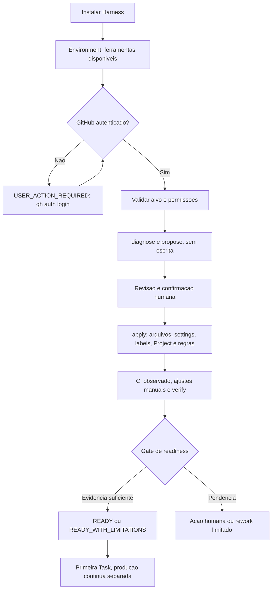
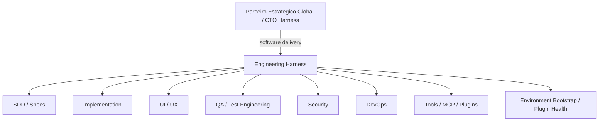

# Engineering Harness

Conjunto de plugins e skills para orquestrar engenharia de software como um **Engineering Harness**: diagnosticar demandas, fechar escopo, gerar specs, resolver capacidades, executar trabalho especializado, preservar handoffs, validar resultados e controlar gates de entrega.

O repositorio continua chamado `Dev-workflow` por compatibilidade, mas o papel central do `dev-workflow-standard` mudou. Ele nao e mais apenas um organizador/distribuidor de tasks; agora funciona como o **harness de engenharia**, responsavel por transformar planejamento em execucao verificavel sem substituir as regras locais, o PRD, a arquitetura existente ou a aprovacao humana.

## Instale com sua LLM

**Copie o prompt abaixo e cole no agente que voce usa para desenvolver.**
Ele orienta o agente a executar a instalacao, nao apenas listar comandos.
O agente precisa ter acesso ao terminal e aos arquivos do seu ambiente;
um chat sem essas ferramentas so consegue orientar. Autenticacoes e aprovacoes
do host continuam com voce.

```text
Instale e configure o Engineering Harness deste repositorio no meu ambiente:
https://github.com/guilhermedemorais-dev/Dev-workflow

Quero que voce execute a instalacao assistida, nao apenas me entregue um tutorial.

1. Identifique meu sistema operacional, o host de agentes que estou usando e
   as instalacoes existentes. Se nao conseguir identificar o host ou o destino,
   pergunte. Nao presuma caminhos, comandos ou suporte a plugins.
2. Consulte a branch main atual do repositorio. Leia README.md, AGENTS.md e as
   skills canonicas dev-workflow-standard e dev-environment-standard, incluindo
   as referencias exigidas para instalacao. Confira manifests e marketplaces.
   Nao use branches nao publicadas sem minha escolha explicita.
3. Reutilize um checkout existente se for adequado, preservando alteracoes
   locais. Se precisar baixar o repositorio, use uma pasta nova e informe o
   destino. Nao sobrescreva configuracoes, plugins ou arquivos meus.
4. Resolva o procedimento de instalacao suportado pela versao real do meu host,
   usando sua ajuda local e documentacao oficial quando necessario. Prefira o
   marketplace quando suportado. Nao invente um instalador ou outro bootstrap.
5. Apresente um plano curto com plugins disponiveis nessa revisao, dependencias,
   destinos e alteracoes de configuracao. Proponha o conjunto de software
   delivery disponivel, mantendo a camada global como opcional. Peca minha
   confirmacao do conjunto e do escopo local ou global antes de instalar.
6. Depois da confirmacao, execute as acoes aprovadas e verifique cada resultado.
   Use o Environment Bootstrap existente para requisitos ausentes, com preparo
   seletivo. Nao instale todos os MCPs, scanners, runtimes ou ferramentas do
   catalogo. Mudancas privilegiadas ou fora do plano exigem nova aprovacao.
7. Configure a camada de executores do Harness. Leia o provider registry atual,
   detecte quais credenciais existem sem exibir valores, gere apenas propostas
   de blocos para o host (por exemplo config.toml no Codex), preserve e faca
   backup da configuracao existente antes de qualquer merge e apresente os links
   oficiais de setup/documentacao dos providers escolhidos. Priorize providers
   OpenAI-compatible verificados, incluindo NVIDIA NIM quando solicitado.
   Nunca grave API keys no repositorio. Rode status/probe e registre
   CONFIGURED separadamente de AVAILABLE. Se nenhum executor externo compatível
   for comprovado, reporte modo single-agent/degradado em vez de fingir delegacao.
8. Verifique o backend opcional de contexto. Prefira Potpie quando instalado e
   saudavel; se ausente, mantenha o fallback local do Harness. Nao ingira fontes
   externas nem envie codigo sensivel sem autorizacao. Required sources da Task
   continuam obrigatorias independentemente do ranking do retriever.
9. Pergunte quais integracoes opcionais preciso. Hostinger, AWS e WordPress
   somente quando solicitados e com conta/site e permissoes definidos. Nunca
   peca tokens, senhas ou cookies no chat; conduza login pelo fluxo seguro do
   host. Nao autorize cobrancas, deploy, DNS ou publicacao por instalar um MCP.
10. Confirme quais plugins o host realmente reconhece e qual revisao esta ativa.
   Rode as verificacoes locais aplicaveis e um teste minimo, sem efeitos
   externos, de descoberta/carregamento da skill. Se exigir reiniciar ou abrir
   uma nova sessao, explique e deixe essa verificacao pendente ate ser feita.
11. Entregue um resumo: instalado e verificado, pendencias, comandos executados,
   caminhos alterados e como comecar a usar. Diferencie estrutura valida,
   plugin carregado, MCP autenticado, provider configurado e provider/modelo
   realmente disponivel. Nao declare sucesso sem evidencia.

Se faltar permissao ou ferramenta para executar, diga exatamente o bloqueio
e a menor acao que preciso fazer. Nao altere codigo do meu projeto, nao faca
commit/push e nao remova instalacoes existentes durante esse processo.
```

Quer apenas usar os plugins? Comece pelo prompt acima. Quer alterar o projeto
ou contribuir? Continue no [guia do desenvolvedor](#comece-aqui-desenvolvedores).
A [instalacao manual](#instalacao) permanece disponivel como referencia.

## Indice

- [Instale com sua LLM](#instale-com-sua-llm)
- [Do zero ao projeto pronto](#do-zero-ao-projeto-pronto)
- [Desenvolver um software desde a etapa zero](#desenvolver-um-software-desde-a-etapa-zero)
- [Comece aqui: desenvolvedores](#comece-aqui-desenvolvedores)
- [Desenvolvimento local e testes](#desenvolvimento-local-e-testes)
- [Mapa tecnico e fontes de verdade](#mapa-tecnico-e-fontes-de-verdade)
- [Plugins](#plugins) e [arquitetura](#arquitetura-do-engineering-harness)
- [Engineering Harness](#dev-workflow-standard-engineering-harness)
- [Relatorios humanos](#human-execution-reporting) e [tools por skill](#skill-owned-tool-registry)
- [UI/UX](#uiux-standard), [Security](#security-standard) e [SDD](#sdd-spec-factory)
- [Implementation](#dev-implementation-standard) e [DevOps](#devops-standard)
- [Reverse Engineering](#reverse-engineering-standard) e [SEO](#seo-standard)
- [Setores e Context Routing](#setores-e-context-routing) e [QA independente](#qa-testing-standard)
- [Instalacao](#instalacao), [compatibilidade](#compatibilidade) e [uso](#uso-recomendado)
- [Como contribuir](#como-contribuir)
- [Diagnostico para colaboradores](#diagnostico-para-colaboradores)

## Comece aqui: desenvolvedores

Este repositorio entrega **instrucoes versionadas para agentes, adaptadores de
plugins, templates e utilitarios Python**. Nao e uma aplicacao web, um servidor
MCP unico nem um servico que executa sozinho. O agente no host le as skills,
usa ferramentas autorizadas e devolve evidencias; o Harness governa esse fluxo.

Voce pode contribuir sem instalar todos os plugins ou conectar contas cloud.
Para entender o projeto, siga esta ordem:

1. Leia [AGENTS.md](AGENTS.md), o mapa de responsabilidades e regras locais.
2. Execute os testes abaixo para conhecer o baseline do seu checkout.
3. Leia a [arquitetura](#arquitetura-do-engineering-harness) e o
   [pipeline](docs/workflow-pipeline.md).
4. Escolha o componente no mapa tecnico e leia seu `SKILL.md` completo;
   carregue referencias conforme o assunto da mudanca.
5. Consulte o [exemplo de Task](docs/examples/sector-context-qa/TASK-EXAMPLE.md)
   e seu [contrato JSON](docs/examples/sector-context-qa/execution-contract.json).
   Sao exemplos sinteticos, nao funcionalidades de uma aplicacao entregue.
6. Siga [Como contribuir](#como-contribuir) antes de implementar e abrir um PR.

O README descreve a revisao em que esta versionado. Conteudo de uma branch de
trabalho pode ainda nao existir na `main` ou no plugin instalado. Confira a
branch, o commit e a origem do pacote ao reproduzir qualquer comportamento.

## Do zero ao projeto pronto

O Engineering Harness coordena agentes especializados para preparar e desenvolver
seu projeto. Instalar o plugin nao configura automaticamente o GitHub, nao autentica
contas e nao autoriza producao. O onboarding abaixo e para **um repositorio-alvo
que voce controla**, antes da primeira Task que dependa de governanca remota.
Para apenas contribuir neste plugin, siga os testes locais da proxima secao.

### Roadmap do desenvolvedor

| Etapa | O agente faz | Voce faz / criterio para avancar |
| --- | --- | --- |
| Fase 0 | Orienta a instalacao do Engineering Harness no host escolhido | Use o prompt de instalacao acima; confirme origem e versao ativa |
| Fase 1 | Environment diagnostica Git, Python 3.11+ e GitHub CLI (`gh`) | Autorize preparacao somente se algo estiver ausente; nenhuma instalacao silenciosa |
| Fase 2 | Verifica autenticacao sem exibir credenciais | Se houver `USER_ACTION_REQUIRED`, autentique pelo fluxo oficial e retome |
| Fase 3 | DevOps distingue acesso ao repo, administracao, organizacao e Projects | Confirme owner/repositorio e obtenha apenas as permissoes necessarias |
| Fase 4 | `diagnose` consulta arquivos, settings, labels, Project, CI e capacidades | Confira o alvo e as lacunas; diagnostico nao altera nada |
| Fase 5 | `propose` compara estado atual com desired state e mostra diffs | Revise proposta, efeitos e fallback de cada limitacao; confirme a proposta exata |
| Fase 6 | `apply --confirm` aplica somente a proposta revisada ainda compativel | Mantenha gates humanos; drift exige nova proposta e confirmacao |
| Fase 7 | Reutiliza/cria Project, completa Status e prepara board quando suportado | Ajuste agrupamento/automacoes que exigirem interface e guarde evidencia |
| Fase 8 | Prepara CI a partir da stack, lockfiles e comandos realmente existentes | Revise o workflow e publique por PR autorizado; aguarde checks reais |
| Fase 9 | `verify` consulta novamente a configuracao e confronta requisitos | Resolva pendencias ou aprove fallback governado; nao confunda criado com validado |
| Fase 10 | Harness reconcilia Environment, acesso, governanca, CI e gates | `PROJECT READY` apenas com verificacao e evidencias; primeira Task pode iniciar |

As fases 6–8 sao partes do mesmo escopo aprovado, nao tres autorizacoes implicitas.
Arquivos locais ainda precisam de commit/PR/publicacao autorizados para existir no
GitHub. A confirmacao de governanca nao autoriza push, merge, aprovacao de PR ou deploy.


```mermaid
flowchart TD
    A["Instalar Harness"] --> B["Environment: ferramentas disponiveis"]
    B --> C{"GitHub autenticado?"}
    C -->|Nao| D["USER_ACTION_REQUIRED: gh auth login"]
    D --> C
    C -->|Sim| E["Validar alvo e permissoes"]
    E --> F["diagnose e propose, sem escrita"]
    F --> G["Revisao e confirmacao humana"]
    G --> H["apply: arquivos, settings, labels, Project e regras"]
    H --> I["CI observado, ajustes manuais e verify"]
    I --> J{"Gate de readiness"}
    J -->|Evidencia suficiente| K["READY ou READY_WITH_LIMITATIONS"]
    J -->|Pendencia| L["Acao humana ou rework limitado"]
    K --> M["Primeira Task, producao continua separada"]
```

### Conectar GitHub sem entregar token ao agente

O agente verifica `gh --version`, autenticacao e acesso com saida sanitizada.
`AUTH_REQUIRED` e um handoff humano, nao motivo para reinstalar o plugin:

```bash
gh auth login --hostname github.com
gh auth status --hostname github.com
```

Faca o login no seu terminal/navegador, nunca cole PAT, senha, cookie ou codigo
de autenticacao no chat. O helper nao le nem copia arquivos de credenciais,
nao executa `gh auth token` e nao faz login por voce. Depois diga ao agente para
retomar o diagnostico. Se Projects exigir escopo adicional, o agente explica
qual capacidade faltou antes de orientar um refresh minimo, por exemplo:

```bash
gh auth refresh --hostname github.com --scopes read:project
# Somente quando for preciso escrever no Project e voce autorizar:
gh auth refresh --hostname github.com --scopes project
```

Escopo OAuth nao concede administracao do repositorio ou da organizacao.
Instalacao de CLI, autenticacao, acesso e autorizacao sao verificacoes diferentes.
`authentication != authorization`; `repository access != repository admin`.

### Governanca GitHub dentro do DevOps

Nao existe uma nova skill de bootstrap. `devops-standard` possui a capacidade
**GitHub Repository Governance** e seu helper Python; Environment so prepara
ferramentas, Security revisa permissoes/segredos quando aplicavel e o Harness
reconcilia a entrega. A configuracao desejada fica em `.github/governance.json`
do projeto-alvo, usando o [template versionado](plugins/devops-standard/skills/devops-standard/templates/github-governance.json).
Usamos JSON para aproveitar a biblioteca padrao, sem instalar um parser YAML.
Nao versione credenciais, estado de login, IDs de Project/campos/opcoes ou
resultados de execucao nesse contrato.

| Operacao | Efeito e gate |
| --- | --- |
| `diagnose` | Apenas leitura, identifica estado e capacidades observadas |
| `propose` | Apenas leitura, retorna proposta com diffs e vinculo ao alvo/estado |
| `apply --confirm` | Exige a proposta exata revisada, verifica drift antes de escrever |
| `verify` | Apenas leitura, consulta novamente e emite readiness baseada em evidencia |

Uma proposta nao e um script arbitrario para executar. O helper recalcula as
acoes permitidas; alterar alvo, desired state ou estado relevante invalida a
proposta. Reexecutar nao deve duplicar labels/Project/Status. Aplicacao parcial
para e relata o que aconteceu; nao ha rollback remoto atomico nem exclusao
automatica para "voltar ao normal". Corrigir, propor novamente e confirmar e
mais seguro que repetir cegamente a mesma mutacao.

Por privacidade, o diff da proposta omite as linhas antigas dos arquivos; revise
o conteudo atual localmente junto do novo conteudo proposto. O hash do arquivo
antigo continua vinculando a aprovacao. Marcadores sensiveis reconhecidos bloqueiam
a proposta sem eco; isso nao substitui uma revisao de segredos do projeto.

Arquivos preparados incluem CODEOWNERS, templates de Issues e PR, CONTRIBUTING,
estrutura de docs e workflow de qualidade conforme a stack. Settings podem
propor squash como metodo de merge e exclusao da branch apos merge; a branch
principal e o prefixo das branches de agente continuam configuraveis.
Arquivos existentes e politicas mais fortes devem ser preservados ou apresentados
em diff para decisao, nunca substituidos silenciosamente.

### Project, Kanban e CI

O Project e procurado por owner/titulo antes de criar; IDs sao descobertos na
execucao. As oito etapas do fluxo sao:

```text
Backlog -> Discovery / SDD -> Ready for Dev -> In Progress
        -> Validation -> In Review -> Awaiting Final Approval -> Done
```

`blocked` e uma label, nao uma coluna. Validation recebe a validacao tecnica;
In Review corresponde ao PR; Awaiting Final Approval espera o responsavel
humano apos CI e setores aprovados. Done somente apos **merge humano** observado.
Um checkpoint local `COMPLETED` nao move o card para Done. Revise/desative
automacoes que movam para Done apenas por fechar uma Issue ou PR sem merge.
O limite padrao e tres ciclos de rework, depois diagnostico e bloqueio explicito.

O helper pode criar/atualizar uma view board pela API disponivel, mas agrupar por
Status e configurar Auto-add de Issues abertas deste repo em Backlog podem
exigir ajuste manual. A API nao expor uma configuracao nao significa que o
agente a executou. `MANUAL_ACTION_REQUIRED` deve indicar passo, alvo e evidencia
faltante. Projetos existentes preservam opcoes e valores de Status.

CI considera Node/Next, PHP/Laravel, Python e Go quando detectados. Prefere o
gerenciador/lockfile e scripts nativos existentes; nao inventa `lint`, `test`,
`typecheck` ou `build` para uma stack que nao os possui. Workflow criado nao
significa workflow executado. Checks obrigatorios so sao propostos a partir de
checks reais observados; falta de evidencia continua pendencia, nao sinal verde.

### Capacidades, limites e readiness

O Harness pode diagnosticar/preparar ambiente, gerar specs e Human Tasks, rotear
contexto, coordenar implementacao, QA e Security, preparar PR, governanca e CI.
DevOps pode reconciliar settings, labels, templates, Project e regras quando as
APIs e permissoes do alvo permitirem. Os detalhes tecnicos, comandos do helper,
schema, fontes oficiais e teste manual isolado estao na
[referencia GitHub Governance](plugins/devops-standard/skills/devops-standard/references/github-governance.md).

Nao faz automaticamente: login, concessao de permissoes, instalacao sem aprovacao,
uso de token fornecido em chat, bypass de plano, aprovacao/merge de PR, force push
na main ou deploy. Nao pede que voce leia uma SKILL para descobrir esses limites.

Plano, tipo de owner e visibilidade sao contexto, nao prova isolada de capacidade.
Um erro 403 nao prova que "o plano Free nao permite". Cada capacidade distingue
suporte, permissao insuficiente, falta de configuracao e falta de validacao.
CODEOWNERS presente nao prova review obrigatorio; regra criada nao prova
enforcement ativo: `configured != enforced`; `created != validated`.

| Readiness | Interpretacao |
| --- | --- |
| `READY` | `verify` executado e requisitos aplicaveis comprovados |
| `READY_WITH_LIMITATIONS` | Verificado, com limitacoes declaradas e fallback suficiente explicitamente aprovado |
| `AUTH_REQUIRED` | Acao humana de autenticacao necessaria para continuar |
| `BLOCKED` | Requisito essencial sem rota segura ou conflito nao resolvido |
| `NOT_VALIDATED` | Evidencia ainda insuficiente; nao anunciar projeto pronto |

O gate exige Environment PASS, autenticacao quando governanca remota for requerida,
acesso, arquivos, configuracao remota, Project/CI PASS ou N/A justificado e gates
humanos documentados. Aprovar fallback nao comprova que uma acao manual foi feita:
registre alvo, revisao, data, resultado e referencia verificavel separadamente.
`PROJECT READY != PRODUCTION AUTHORIZED`; CI verde tambem nao autoriza producao.

Para READY, o helper exige checkout limpo na mesma revisao remota verificada e
compara os arquivos de governanca/stack com essa revisao. Criar arquivos localmente
e aguardar CI de um commit anterior nao satisfaz o gate. Guarde propostas e
evidencias privadas fora do checkout; publicacao continua uma acao autorizada
separadamente. Esta versao do helper suporta github.com; GitHub Enterprise Server
e outros hosts nao foram homologados.
O helper foi testado em Linux; a escrita local exige primitivas POSIX de protecao
de arquivos. Em plataformas sem esse suporte, como Windows nao homologado, um
plano com escrita local bloqueia antes de qualquer mutacao remota.

Este onboarding ocorre uma vez quando aplicavel. Nas Tasks seguintes reutilize
evidencia compativel; reavalie por drift, mudanca relevante, falha real ou pedido
explicito, sem repetir full bootstrap em toda Task. Nao alegue integracao GitHub
real a partir da suite fake-gh deste plugin.

### Prompt para preparar seu projeto

```text
Use o Engineering Harness instalado para preparar o repositorio-alvo que eu
indicar. Confira origem, branch, HEAD e mudancas locais, sem descartar nada.
Siga o roadmap de onboarding. Environment verifica/prepara ferramentas apenas
com a autorizacao necessaria; DevOps cuida de GitHub Repository Governance.
Nao configure o repositorio do plugin por engano.
Se faltar login, entregue USER_ACTION_REQUIRED com gh auth login e aguarde;
nao solicite tokens, senhas ou cookies no chat.
Execute diagnose e propose, explique os diffs e limites, e pare para minha
confirmacao antes de apply --confirm. Use somente a proposta revisada e bloqueie
drift. Verifique de novo, reporte READY/READY_WITH_LIMITATIONS apenas com provas.
Nao faca push, merge, aprove PR ou deploy por causa desta solicitacao.
Ao concluir o onboarding, proponha a primeira Task com seus gates humanos.
```

## Desenvolver um software desde a etapa zero

**Instalar o Harness no agente e preparar o repositorio do seu software sao
duas entregas diferentes.** O plugin fornece metodologia e ferramentas de
apoio; nao cria um produto, configura o GitHub ou aprova uma entrega sozinho.
Voce informa o problema, decide escopo e autoriza os gates. O agente aplica as
skills, executa as capacidades disponiveis e registra o que realmente ocorreu.

O repositorio-alvo e o do **seu software**, nao `Dev-workflow`. Se ainda nao
existir, primeiro combinar nome, owner, visibilidade, destino local e autorizacao
para cria-lo. O helper de governanca trabalha sobre um repositorio existente;
nao e um criador automatico de repositorios. Em produto existente, preservar
codigo, regras, documentos, Issues, Project e configuracoes, registrando o baseline.

### Jornada do produto e metodos utilizados

As etapas abaixo descrevem o uso do produto, nao outro instalador nem uma
promessa de executar tudo sem intervencao humana. O onboarding tecnico da secao
anterior prepara a governanca antes das Tasks que dependem dela.

| Etapa | Trabalho do agente e metodo | Registro e condicao para avancar |
| --- | --- | --- |
| 0. Entender o negocio | Harness faz Discovery colaborativo: problema, usuarios, fluxos, resultado mensuravel, restricoes, dados sensiveis, prazo, custo e fora do escopo. A camada global opcional ajuda nas decisoes de estrategia e build vs buy. | Contexto e decisoes em PRD/spec do projeto; perguntas pendentes e hipoteses explicitas. Nao escolher stack ou implementar por suposicao silenciosa. |
| 1. Pesquisar e definir a solucao | SDD pesquisa referencias da stack, alternativas, arquitetura, APIs e riscos; UI/UX prepara Design Guide e mockups quando houver interface. | `docs/biblioteca-referencias/`, specs e `docs/design/` quando aplicavel. Fontes com origem, data, proposito e decisao; aprovacao das escolhas materiais. |
| 2. Preparar ambiente e governanca | Environment verifica capacidades; DevOps diagnostica o repositorio, propoe configuracoes e aplica somente apos confirmacao. | `.github/governance.json`, proposta revisada, configuracoes observadas e resultado de `verify`. Login, acesso, administracao e acesso ao Project sao checks separados. |
| 3. Transformar escopo em trabalho executavel | Spec-Driven Development: product, module, page/feature e component specs, banco, API e validacoes conforme a complexidade. Uma Task completa por modulo funcional, com microtarefas internas. | Issue humana completa e um `docs/execution/TASK-XXX.json` equivalente. Publicar `DISCOVERY_SDD_COMPLETED` e pedir aprovacao antes de Ready for Dev. |
| 4. Implementar o modulo | Implementation recebe a lista JSON e fontes necessarias; busca reutilizacao, aplica mudanca minima, usa TDD quando aplicavel e executa testes do desenvolvedor. | Branch de trabalho, diff, testes e `EXECUTION_RECEIPT`. Spec, banco, backend, frontend e testes continuam dentro da mesma Task do modulo. |
| 5. Validar independentemente | QA verifica comportamento e regressao; Security valida riscos/achados; UI/UX verifica interface, acessibilidade e Design Guide; DevOps verifica a superficie operacional aplicavel. | Cada owner registra seu resultado e evidencia na matriz de setores. Falha retorna para correcao e reteste; sem evidencia nao ha PASS. |
| 6. Revisar e entregar | Harness reconcilia contrato, implementacao, setores, docs, CI e PR. A pessoa responsavel revisa a entrega e decide o merge. | PR vinculado a Issue e specs, criterios comprovados e aceite humano. Done somente apos merge humano observado. |
| 7. Operar e evoluir | Deploy, migracao produtiva e rollback sao operacoes separadas, aprovadas para o alvo correto; incidentes e novas demandas retornam ao fluxo. | Evidencia operacional, limitacoes e proxima Task. Merge ou CI verde nao autorizam producao. |

Os metodos se complementam: Discovery reduz ambiguidade; SDD fixa o contrato;
pesquisa fundamenta decisoes; mockup-first alinha a interface; reutilizacao e
mudanca minima evitam duplicacao; TDD/testes produzem feedback; QA independente
e revisao de seguranca confrontam a implementacao; Kanban e receipts tornam
progresso e evidencias rastreaveis. O nome de um metodo no card nao prova sua
execucao. O detalhe normativo permanece nas skills e no
[pipeline](docs/workflow-pipeline.md).

### O que precisa existir no repositorio do seu software

O quadro separa o que o helper pode preparar do que o agente deve construir
com voce. Nao copie o repositorio inteiro do Harness para dentro do produto.
Use a estrutura canonica ja existente quando equivalente, sem duplicar docs.

| Arquivo ou area no projeto-alvo | Finalidade e responsavel | Como fica pronto |
| --- | --- | --- |
| `AGENTS.md` e README do produto | Regras locais, comandos reais, arquitetura, limites e fontes de verdade, mantidos pelo time/Harness. | Elaborados ou atualizados em trabalho aprovado; o helper de governanca nao gera `AGENTS.md` automaticamente. |
| PRD, `docs/specs/` e specs por modulo | Objetivos, comportamento e contratos produzidos pela SDD com o usuario. | Conteudo revisado e proporcional ao risco; criar pasta nao significa escrever specs. |
| `docs/biblioteca-referencias/` | Fontes tecnicas da stack e caminhos exatos para consulta durante cada Task. | Pesquisa validada pela SDD; nao e gerada automaticamente pelo helper. |
| `docs/design/` | Design Guide, tokens, componentes, referencias e mockups quando houver UI. | Produzido/reutilizado com UI/UX e aprovacao pertinente. |
| `.github/governance.json` | Politica desejada de governanca do projeto. | Adaptar e revisar o [template DevOps](plugins/devops-standard/skills/devops-standard/templates/github-governance.json) antes de executar o helper. |
| `.github/CODEOWNERS` | Indicar responsaveis por revisao. | Helper pode propor o arquivo; revisao obrigatoria depende tambem das regras efetivas no GitHub. |
| `.github/ISSUE_TEMPLATE/config.yml`, `bug.yml`, `feature.yml`, `task.yml` | Formularios de entrada para organizar demandas. | Helper pode preparar formularios basicos. Eles nao substituem o card completo gerado pela SDD. |
| `.github/PULL_REQUEST_TEMPLATE.md` e `CONTRIBUTING.md` | Orientar contribuicao e pacote de revisao. | Gerados/reconciliados pelo helper somente com proposta aprovada. |
| `docs/tasks/` e `docs/execution/` | Espelhos locais quando necessarios e contrato JSON unico de cada Task. | Helper prepara estrutura; SDD/Harness preenchem e reconciliam o conteudo com a Issue. |
| `.github/workflows/quality.yml` ou CI existente | Executar checks reais da stack em ambiente reproduzivel. | Reutilizar CI existente ou revisar geracao suportada. Workflow local precisa ser publicado e executado; isso exige autorizacao separada. |
| Lockfile, versoes e scripts da stack | Tornar instalacao e validacao reproduziveis. | Definidos no projeto; helper nao inventa scripts nem instala dependencias durante diagnostico. |

Os arquivos exatos gerados, restricoes de stack e regras de preservacao estao
na [referencia de governanca](plugins/devops-standard/skills/devops-standard/references/github-governance.md).
O helper prepara as pastas `docs/specs`, `docs/tasks` e `docs/execution`, mas
nao escreve o PRD, o design ou o planejamento do produto por voce.

### Configuracao de governanca: decisoes que voce precisa fechar

O contrato `.github/governance.json` nao contem credenciais nem estado de login.
Revisar estes campos do template com o agente, antes de autorizar aplicacao:

| Grupo | Decisao do projeto |
| --- | --- |
| `repository` | Host, owner, nome, branch principal, prefixo das branches do agente e politica de merge/exclusao de branch. O baseline propoe squash, mas nao substitui sua politica sem revisao. |
| `project` | Usar ou nao GitHub Project, titulo, view e oito estados. Reutilizar Project existente; desabilitar exige justificativa. |
| `labels` | Tipos e condicoes, incluindo `blocked`, `needs-info` e `rework`; preservar labels existentes. |
| `human_gates` | Aprovacoes humanas de Task, PR, merge e deploy. |
| `automation` | Sem auto-merge ou auto-deploy; limite de ciclos de rework, tres no baseline. |
| `local` | Geracao de arquivos e responsaveis CODEOWNERS reais; arquivos divergentes precisam de diff revisado. |
| `ci` | CI aplicavel e nomes de checks efetivamente observados, nao nomes inventados para completar o JSON. |
| `rules` | Protecao da branch e revisoes viaveis para o time, considerando permissoes e suporte observados. |
| `exceptions` | Limitacoes com justificativa e aprovacao explicita; nunca adicionar excecao apenas para obter READY. |

O ciclo de aplicacao e **diagnose -> propose -> confirmacao humana ->
apply --confirm -> verify**. Os comandos com os caminhos a resolver estao na
[referencia do helper](plugins/devops-standard/skills/devops-standard/references/github-governance.md).
`diagnose`, `propose` e `verify` nao alteram GitHub nem arquivos do projeto.
O agente apresenta a proposta concreta, seu alvo e os diffs antes de `apply`.
Se o estado mudar, a proposta precisa ser refeita e confirmada novamente.

No GitHub, conferir separadamente: Issues habilitadas e acessiveis, permissoes
da conta para cada operacao, Project correto, Status e agrupamento do board,
labels, politica de merge, regras efetivas da branch e checks publicados.
Estar autenticado nao comprova administracao; existir CODEOWNERS nao comprova
enforcement; configurar CI nao comprova que ele rodou.
Agrupamento do board e automacoes que a API nao permitir configurar ficam como
acao manual identificada, nunca como tarefa concluida por inferencia.

### Como a demanda vira Issue, card e contrato JSON

1. **Resolver o alvo e o trabalho existente.** Identificar owner/repositorio e
   Project; conferir Tasks relevantes para evitar duplicar ou fragmentar o
   mesmo modulo. Criacao/publicacao remota ocorre no escopo autorizado.
2. **Construir o card humano completo.** Usar o
   [template de Task](plugins/sdd-spec-factory/templates/task-template.md):
   resumo no cabecalho, objetivo, atual/esperado, escopo/exclusoes, perguntas e
   decisoes, referencias, Design Guide quando aplicavel, microtarefas, owners,
   skills/plugins/tools, checklists, testes, riscos, aceite e gates.
   O corpo da Issue contem esse card, nao apenas um link para Markdown local.
3. **Gerar o equivalente para a LLM.** Um arquivo
   `docs/execution/TASK-XXX.json` por Task, com as mesmas regras normativas e
   `contract_revision`. Todas as listas ficam em `execution_lists`; cada lista
   recebe um prompt copiavel com link para esse JSON e seu `list_id`, nao um
   arquivo ou prompt por subitem. Divergencia entre card e JSON bloqueia execucao.
4. **Publicar e verificar.** Registrar URL/numero retornado e reler o corpo da
   Issue para conferir conteudo, links e revisao. Inserir/verificar o item no
   Project correto quando aplicavel. Criar a Issue nao comprova sua inclusao no
   board; Auto-add nao deve ser presumido nem usado como prova retroativa.
5. **Encerrar Discovery com comentario.** Publicar `DISCOVERY_SDD_COMPLETED`
   com decisoes, fontes, pendencias e equivalencia card/JSON; registrar a URL
   do comentario e so entao pedir aprovacao para Ready for Dev.
6. **Executar e acompanhar.** Atualizar checklists apenas com evidencia;
   publicar checkpoints materiais na mesma Issue. Status de execucao, achados
   e receipts ficam no registro de evidencias/comentarios, nao como estado
   mutavel no JSON normativo. Revisao de requisito atualiza card e JSON juntos.

O comentario relata o que foi feito, ferramentas realmente usadas, comandos e
resultados, arquivos alterados, lacunas, bloqueios e proximo passo. Termina com
superficie alterada e depois consumo de tokens; sem medicao do runtime, usar
`NOT_AVAILABLE`, nunca inventar contagem. Cada publicacao precisa de URL ou ID
retornado. Consulte o [protocolo de comentarios](plugins/dev-workflow-standard/skills/dev-workflow-standard/references/execution-report-comments.md).

Se nao houver acesso ao GitHub, preservar o trabalho local como rascunho ou
`NOT PUBLISHED` e explicar o bloqueio. Arquivo criado localmente nao e Issue
publicada, comentario preparado nao e comentario enviado, e checklist marcado
nao substitui teste executado. Templates e protocolo orientam o agente; nao ha
um servico em segundo plano que cria Issues ou garante obediencia da LLM.

### Checklist antes da primeira implementacao

- [ ] Repositorio-alvo e ambiente identificados; mudancas locais preservadas.
- [ ] Problema, usuarios, escopo inicial e decisoes materiais aprovados.
- [ ] Specs/fontes necessarias disponiveis; Design Guide/mockup quando aplicavel.
- [ ] Skills e ferramentas requeridas realmente disponiveis; instalacoes e autenticacoes pendentes declaradas.
- [ ] Governanca diagnosticada, proposta revisada, aplicacao autorizada e verificacao registrada quando exigida.
- [ ] Issues/Project/CI/regras comprovados ou N/A justificado dentro da politica, sem transformar pendencia obrigatoria em excecao.
- [ ] Card humano publicado e conferido; JSON equivalente com fontes e listas validas.
- [ ] Discovery comentado na Issue e Task aprovada pela pessoa responsavel.
- [ ] Branch, arquivos permitidos, condicoes de parada, testes e validadores definidos.

Sem esses requisitos aplicaveis, a proxima acao e fechar contexto ou resolver
o bloqueio, nao iniciar implementacao nem declarar o projeto pronto.

### Prompt para iniciar um software do zero

```text
Use o Engineering Harness para iniciar meu software desde o Discovery.
Problema/ideia: <descreva>.
Repositorio-alvo: <owner/repo e caminho, ou informe que ainda nao existe>.
Comece por perguntas sobre negocio, usuarios, fluxos, dados, limites e sucesso.
Pesquise referencias da stack e registre as decisoes no projeto; quando houver
UI, inclua Design Guide e mockups. Nao implemente enquanto o contexto e o
escopo nao estiverem aprovados.
Confira o ambiente e proponha a governanca do repositorio-alvo com o helper
DevOps existente. Explique arquivos, settings, Project, regras, CI e passos
manuais. Pare para minha confirmacao antes de aplicar a proposta.
Depois gere uma Task completa por modulo: Issue humana integral, JSON unico
equivalente, listas com prompt copiavel, referencias e validadores por setor.
Confira a Issue remota e publique o comentario de encerramento do Discovery.
Peça aprovacao antes de executar. Nao crie repositorio, publique, faca push,
merge ou deploy sem a autorizacao correspondente. Nao peca segredos no chat.
```

## Desenvolvimento local e testes

### Stack e requisitos

| Camada | Tecnologia e necessidade |
| --- | --- |
| Metodologia | Markdown em `SKILL.md`, referencias, specs e templates |
| Contratos e descoberta | JSON para manifests, marketplaces, contratos e registries; YAML para metadata de agentes |
| Utilitarios e suite | Python 3.11+; Environment usa `tomllib` da biblioteca padrao |
| Controle de versao | Git; conta GitHub somente para colaboracao remota |
| Execucao por agente | Host compativel e autorizado, conforme a secao Instalacao |
| Ferramentas externas | Apenas as exigidas pela task; nao sao pre-requisito para ler docs ou rodar a suite estrutural |

Nao ha backend, banco de dados, migrations, servidor de desenvolvimento ou
build frontend na raiz. Nao execute `npm install`, configure um `.env` de
aplicacao ou suba Docker para conseguir editar uma skill. A suite usa
`unittest` e biblioteca padrao; testes de integracoes usam fixtures/mocks e
nao substituem verificacao real das contas e ferramentas externas.

### Primeiro checkout

Esta etapa manual e para desenvolver ou contribuir com o repositorio. Para
instalar os plugins com ajuda do agente, use [o prompt inicial](#instale-com-sua-llm).

Em uma pasta onde ainda nao exista `Dev-workflow`:

```bash
git clone https://github.com/guilhermedemorais-dev/Dev-workflow.git
cd Dev-workflow
git status --short --branch
git rev-parse HEAD
python3 --version
PYTHONDONTWRITEBYTECODE=1 python3 -m unittest discover -s tests -v
git diff --check
```

O resultado esperado da suite e `OK`, com exit code 0. A quantidade de testes
depende da revisao; registre o numero efetivamente executado, nao copie o de
outra entrega. Se houver falha antes da sua alteracao, registre-a como baseline.
Nao descarte mudancas locais para tentar obter um checkout limpo.

Para uma verificacao focada de documentacao:

```bash
PYTHONDONTWRITEBYTECODE=1 python3 -m unittest discover -s tests -p 'test_readme.py' -v
```

Execute novamente a suite completa antes de entregar. Ela verifica contratos,
estrutura, invariantes e comportamento dos helpers em escopo controlado.
Nao comprova obediencia futura de uma LLM, autenticacao MCP, qualidade visual,
deploy ou QA de uma aplicacao cliente. Registre esses limites no PR.

Diagnostico opcional do pacote, sem instalar ferramentas:

```bash
python3 plugins/dev-environment-standard/skills/dev-environment-standard/scripts/environment.py doctor --repo-root . --workspace . --json
```

`doctor` e read-only e nao executa a suite. Um estado `DEGRADED` exige ler as
lacunas; nao significa automaticamente que o Markdown esta incorreto, nem
permite afirmar prontidao completa. Preparacao e reparo sao operacoes separadas,
com consentimento e escopo, descritas na secao Environment.

## Mapa tecnico e fontes de verdade

| Caminho | O que contem / quando alterar |
| --- | --- |
| [AGENTS.md](AGENTS.md) | Mapa curto para agentes; aponta para regras canonicas, nao duplica o manual |
| [docs/workflow-pipeline.md](docs/workflow-pipeline.md) | Ciclo, gates, responsabilidades e profundidade proporcional |
| `plugins/<plugin>/skills/<skill>/SKILL.md` | Instrucoes canonicas do especialista; ponto de entrada de sua metodologia |
| `plugins/<plugin>/skills/<skill>/references/` | Detalhes carregados por necessidade; registries apenas quando o owner os possui |
| `plugins/<plugin>/skills/<skill>/agents/openai.yaml` | Metadata da skill para o host; nao substitui suas instrucoes |
| `plugins/<plugin>/{plugin.json,.codex-plugin/plugin.json,.claude-plugin/plugin.json}` | Adaptadores de descoberta/empacotamento, nao tres copias da metodologia |
| [.agents/plugins/marketplace.json](.agents/plugins/marketplace.json) e [.claude-plugin/marketplace.json](.claude-plugin/marketplace.json) | Catalogos de distribuicao; devem apontar para bundles existentes |
| [plugins/sdd-spec-factory/templates/](plugins/sdd-spec-factory/templates/) | Templates canonicos de specs, Task, contrato, QA e PR |
| [plugins/dev-implementation-standard/templates/](plugins/dev-implementation-standard/templates/) | Relatorios de execucao e checkpoints humanos |
| `docs/specs/`, `docs/tasks/`, `docs/execution/` | Intencao duravel, acompanhamento humano e indice operacional de cada entrega |
| [tests/](tests/) | Suite de regressao, verificacoes estruturais e fixtures locais |

### Protocolo, codigo executavel e estado local

Existem tres camadas distintas:

1. **Protocolo para agentes:** skills, pipeline, Context Routing e gates dizem
   o que o agente deve fazer. Nao existe um novo motor que interprete o contrato
   e imponha automaticamente todas essas regras.
2. **Execucao deterministica:** [tool-state.py](plugins/dev-workflow-standard/scripts/tool-state.py)
   resolve/detecta/executa ferramentas e mantem observacoes por owner;
   [environment.py](plugins/dev-environment-standard/skills/dev-environment-standard/scripts/environment.py)
   faz discovery, diagnostico e preparo seletivo. A disponibilidade real ainda
   depende da maquina, permissoes e credenciais.
3. **Estado privado do host:** `runtime-state/`, preferencias e evidencias de
   ferramentas nao sao conhecimento compartilhado nem devem ser commitados.
   Veja [.gitignore](.gitignore). Uma maquina nao herda autenticacao de outra.

Nao ha um `.env` global obrigatorio para desenvolver este repositorio.
`TOOL_REGISTRY_PATH` e `TOOL_STATE_PATH` sao overrides pareados do helper para
registry e estado gravavel; `TOOL_RUNTIME_ID` distingue runtimes no fingerprint.
Environment permite `--state-dir` para armazenamento local. Os contratos exatos
estao em [skill-owned-tools](plugins/dev-workflow-standard/skills/dev-workflow-standard/references/skill-owned-tools.md)
e [operations](plugins/dev-environment-standard/skills/dev-environment-standard/references/operations.md).
Credenciais de provedores ficam no mecanismo seguro do host, nunca em templates,
fixtures, receipts ou exemplos publicados.

### Padrao de task: card humano + JSON para a LLM

Toda task nova usa duas representacoes sob a mesma `contract_revision`:

1. **GitHub Issue / Human Task:** card humano completo, com resumo no cabecalho,
   contexto atual e esperado, Discovery/SDD, escopo, referencias, microtarefas,
   setores, pipeline, criterios, riscos, evidencias e gates.
2. **Execution Contract v2:** as mesmas especificacoes normativas em JSON,
   organizadas para leitura deterministica da LLM e menor ambiguidade.

Essa equivalencia normativa nao significa duplicar logs. Status de execucao,
resultados, receipts e discussoes ficam na Issue e nos artefatos de evidencia.
Se card e JSON divergirem, a execucao para com
`human_task_json_divergence`; uma alteracao normativa exige atualizar os dois.

O Discovery/SDD e colaborativo: a LLM faz perguntas ao usuario, pesquisa fontes
adequadas a stack e consolida decisoes. Referencias validadas ficam em
`docs/biblioteca-referencias/`; a task roteia arquivo e secao exatos. Trabalho
visual tambem referencia `docs/design/`, Design Guide, tokens, biblioteca de
componentes, referencias visuais e mockup aprovado.

Cada microtarefa declara skill executora, plugin, capability, tool preferencial,
dependencias, referencias, paths, checklist, entregaveis, condicao de conclusao
e validador independente. Depois do planejamento, a LLM publica o comentario
`DISCOVERY_SDD_COMPLETED`; so entao pede aprovacao humana para Ready for Dev.
O comentario so conta como publicado com URL/identificador retornado.

Todos os comentarios materiais terminam com:

- `input_tokens`, `output_tokens`, `total_tokens` e `measurement_source`;
- `changed_files`, alteracoes na Issue/card, JSON/specs/referencias,
  `remote_mutations`, indicador de codigo e branch/commit/PR.

Sem contagem fornecida pelo runtime/API, o valor correto e `NOT_AVAILABLE`.
Estimativa nunca pode ser apresentada como medicao exata.

### Onde cada informacao pertence

| Informacao | Fonte correta | Nao usar como substituto |
| --- | --- | --- |
| Comportamento esperado e restricoes | Spec aprovada | Conversa antiga sem registro |
| Card completo para pessoas, progresso, bloqueios e evidencias | GitHub Issue / Human Task | Markdown local como substituto da Issue |
| Mesmas regras normativas em estrutura para a LLM | Execution Contract v2 | JSON reduzido a indice ambiguo |
| Evidencia mutavel de execucao | Comentarios da Issue e receipts | Logs/resultados dentro do contrato JSON |
| O que foi realmente executado | EXECUTION_RECEIPT e artefatos observaveis | Nome da skill ou task atribuida |
| Comunicacao cronologica | Comentario da Issue | Prova unica de validacao |
| Versao disponivel para execucao | Bundle ativo e evidencias do host | Apenas o checkout ou entrada no marketplace |

Para alterar o routing, comece na [referencia canonica](plugins/dev-workflow-standard/skills/dev-workflow-standard/references/context-routing.md),
depois confira templates, consumidores, exemplos e testes. Para adicionar uma
ferramenta, altere o registry do owner existente, nao crie um catalogo paralelo
no Harness ou no QA. Para adicionar um MCP, consulte a
[MCP Library](plugins/dev-environment-standard/skills/dev-environment-standard/references/mcp-library.json)
e seu protocolo de consentimento; estar catalogado nao significa estar conectado.

## Camada Global

O repositorio tambem inclui o `parceiro-estrategico-global`, uma camada geral e opcional acima dos fluxos especializados. Ela nao mantem um catalogo fixo de plugins. Em cada demanda, identifica a capacidade necessaria, verifica o que realmente esta disponivel no runtime e roteia para a skill, plugin, conector, MCP, ferramenta ou agente mais adequado.

Quando a demanda for desenvolvimento de software, o fluxo pode seguir:

```text
Usuario
  -> parceiro-estrategico-global
  -> identifica dominio/capacidade
  -> dev-workflow-standard (Engineering Harness)
  -> specialists / tools / executors
```

Se nao houver capacidade adequada, a camada global primeiro procura uma opcao existente e consolidada; somente depois propoe instalar, conectar, criar ou evoluir uma capacidade reutilizavel. Ela nao absorve as responsabilidades do Engineering Harness nem das skills especialistas.

Fluxo essencial:

```text
demanda
  -> Engineering Harness
  -> GitHub Issue completa + Execution Contract v2 equivalente
  -> bootstrap curto (task_id + execution_contract_path)
  -> capability routing
  -> skills / tools / executors
  -> execucao real
  -> evidencia
  -> validacao
  -> conclusao ou rework
```

O GitHub Issue/Human Task e o card completo para acompanhamento e decisao. O
Execution Contract v2 em `docs/execution/TASK-XXX.json` contem as mesmas regras
normativas de forma estruturada para a LLM: escopo, requisitos, regras,
referencias, design, microtarefas, testes e criterios. Ambos compartilham
`contract_revision`; divergencia bloqueia a execucao. Logs, resultados e
evidencias mutaveis permanecem nos comentarios e receipts.
O `EXECUTION_RECEIPT` so nasce depois da execucao, a partir de evidencia
observada, e nao e entrada do proprio checkpoint. O
`EXECUTION_REPORT_COMMENT` traduz checkpoints materiais em um diario humano
curto na Issue vinculada, sem substituir task, receipt, Project ou PR.

Regra de manutencao: toda alteracao de arquitetura, workflow, contrato
operacional, instalacao ou uso publico deve atualizar este README no mesmo
conjunto de mudancas. Alteracoes internas sem impacto documentavel devem ao
menos confirmar explicitamente que o README continua correto.

README desatualizado para mudancas de skills, capabilities, tools, estados ou
gates significa `NOT READY TO COMMIT`.

Praticas consolidadas sustentam o repositorio como fonte de verdade, progressive
disclosure, uso de ferramentas reais, feedback loops e validacao mecanica. A
separacao em skills independentes, os gates humanos e os nomes `EXECUTION_RECEIPT`,
`EXECUTION_REPORT_COMMENT`, `SKILL_RECEIPT`, `REUSE_INVENTORY`,
`MINIMAL_CODE_GATE` e `EXECUTION_HANDOFF` sao decisoes ou extensoes locais
deste projeto, nao padroes oficiais da OpenAI. A classificacao completa esta em
[`docs/engineering-harness-audit.md`](docs/engineering-harness-audit.md).

## Plugins

```text
plugins/
  qa-testing-standard/
    .codex-plugin/plugin.json
    .claude-plugin/plugin.json
    plugin.json
    skills/qa-testing-standard/SKILL.md
    skills/qa-testing-standard/references/
  dev-environment-standard/
    .codex-plugin/plugin.json
    .claude-plugin/plugin.json
    plugin.json
    skills/dev-environment-standard/SKILL.md
    skills/dev-environment-standard/scripts/environment.py
  devops-standard/
    .codex-plugin/plugin.json
    .claude-plugin/plugin.json
    plugin.json
    THIRD_PARTY_NOTICES.md
    skills/devops-standard/SKILL.md
    skills/devops-standard/references/
    skills/devops-standard/templates/
  parceiro-estrategico-global/
    .codex-plugin/plugin.json
    .claude-plugin/plugin.json
    plugin.json
    skills/parceiro-estrategico-global/SKILL.md
  dev-workflow-standard/
    .codex-plugin/plugin.json
    .claude-plugin/plugin.json
    plugin.json
    skills/dev-workflow-standard/SKILL.md
  ui-ux-standard/
    .codex-plugin/plugin.json
    .claude-plugin/plugin.json
    plugin.json
    skills/ui-ux-standard/SKILL.md
  security-standard/
    .codex-plugin/plugin.json
    .claude-plugin/plugin.json
    plugin.json
    skills/security-standard/SKILL.md
  sdd-spec-factory/
    .codex-plugin/plugin.json
    .claude-plugin/plugin.json
    plugin.json
    skills/sdd-spec-factory/SKILL.md
    templates/
  dev-implementation-standard/
    .codex-plugin/plugin.json
    .claude-plugin/plugin.json
    plugin.json
    skills/dev-implementation-standard/SKILL.md
    templates/
```

Cada plugin mantem uma unica skill canonica e manifestos adaptadores para
Codex, Claude Code e Antigravity. Isso evita que as regras das tres plataformas
evoluam de forma diferente.

## Arquitetura do Engineering Harness

As skills continuam independentes. O `dev-workflow-standard` atua como control plane de engenharia: resolve a capacidade necessaria, verifica disponibilidade, invoca o executor ou especialista, acompanha o estado da execucao e valida o resultado antes de liberar o proximo gate.

```text
Global / caller
      |
      v
parceiro-estrategico-global
      |
      | software delivery
strategy / architecture / stack / cost / risk
      |
      v
dev-workflow-standard
Engineering Harness
      |
      +--> dev-environment-standard (bootstrap / health)
      +--> sdd-spec-factory
      +--> dev-implementation-standard
      +--> ui-ux-standard
      +--> qa-testing-standard
      +--> security-standard
      +--> devops-standard
      +--> plugins / MCPs / CLIs / scripts / executor LLM
                     |
                     v
              EXECUTION_RECEIPT
                     |
                     v
                 VALIDATION
                     |
                     v
                 COMPLETED
```

As skills especialistas nao foram absorvidas nem descartadas. O harness coordena e valida; cada skill continua dona de sua especialidade.

### Visao rapida da hierarquia


```mermaid
flowchart TD
    A[Parceiro Estrategico Global / CTO Harness] -->|software delivery| B[Engineering Harness]
    B --> C[SDD / Specs]
    B --> D[Implementation]
    B --> E[UI / UX]
    B --> QA[QA / Test Engineering]
    B --> F[Security]
    B --> DOPS[DevOps]
    B --> G[Tools / MCP / Plugins]
    B --> H[Environment Bootstrap / Plugin Health]
```

O `parceiro-estrategico-global` exerce a camada Global/CTO: decide dominio,
estrategia tecnica, build vs buy, arquitetura macro, stack, infraestrutura,
custo e risco. O `Engineering Harness` recebe essa direcao para software e
decide como o trabalho sera especificado, executado e validado. Essa separacao
hierarquica e uma decisao arquitetural local deste projeto.


| Skill | Papel |
| --- | --- |
| `parceiro-estrategico-global` | Camada global: descoberta, verificacao e roteamento dinamico de capacidades |
| `dev-workflow-standard` | Engineering Harness / revisor final |
| `dev-environment-standard` | Bootstrap portatil, preparacao seletiva e Plugin Health |
| `sdd-spec-factory` | LLM de requisitos: specs, Human Task e Execution Contract |
| `dev-implementation-standard` | Agente executor / coder |
| `ui-ux-standard` | LLM especialista em UI/UX |
| `qa-testing-standard` | QA funcional independente, reproducao, regressao e reteste |
| `security-standard` | LLM especialista em seguranca |
| `devops-standard` | Especialista em CI/CD, infraestrutura, operacoes, releases e recuperacao |

Pipeline de ponta a ponta:

```text
Ideia / demanda
  -> Discovery / SDD colaborativo: perguntas ao usuario + pesquisa
  -> sdd-spec-factory consolida specs, referencias e Design Guide
  -> GitHub Issue completa + Execution Contract v2 equivalente
  -> microtarefas com skill/plugin/capability/tool/fontes/paths/checklist
  -> matriz dos dez setores e Context Routing
  -> comentario DISCOVERY_SDD_COMPLETED publicado com URL/identificador
  -> aprovacao humana
  -> executor recebe task_id + execution_contract_path
  -> contrato validado; referencias obrigatorias carregadas sob demanda
  -> skills obrigatorias carregadas + SKILL_RECEIPT
  -> capability registry resolve executor/especialistas
  -> disponibilidade do runtime e verificada
  -> capacidade selecionada e invocada; estado RUNNING
  -> REUSE_INVENTORY + MINIMAL_CODE_GATE
  -> dev-implementation-standard implementa microtarefas e testes do executor
  -> resultado inspecionavel: diff / arquivos / comandos / artefatos
  -> TASK.md atualizada
  -> EXECUTION_RECEIPT completo
  -> EXECUTION_REPORT_COMMENT -> GitHub Issue / historico do Board
  -> dev-workflow-standard entra em VALIDATING
  -> QA funcional / Security QA / UI-UX QA / DevOps-observabilidade independentes
  -> falha retorna para rework e reteste pelo mesmo validador
  -> reconciliacao dos setores e gate do PR
  -> Pull Request quando autorizado
  -> gate final do Harness e review humano
  -> dev-workflow-standard aprova ou solicita rework
  -> aceite e merge humanos
  -> deploy somente com autorizacao separada
```

Regras invariantes:

- `dev-workflow-standard` nunca escreve codigo de produto e nunca pula o
  contrato de intencao proporcional a complexidade da mudanca.
- `dev-implementation-standard` nunca implementa sem task aprovada e nunca altera
  fora do escopo sem registrar justificativa.
- `ui-ux-standard` e obrigatoria quando houver UI.
- `security-standard` e obrigatoria quando houver auth, autorizacao, tokens,
  sessao, dados sensiveis, uploads, pagamentos ou integracoes externas.
- Toda task nova tem Issue completa e JSON v2 com equivalencia normativa e a
  mesma revisao; toda microtarefa aponta a skill e referencias exatas.
- Todo PR aponta para task, issue, branch e specs seguidas.
- Skill mencionada nao e skill aplicada: toda skill obrigatoria gera `SKILL_RECEIPT`.
- Task atribuida nao e task executada: toda delegacao real gera `EXECUTION_RECEIPT`.
- Comentario humano nao e evidencia de execucao: ele resume checkpoints
  materiais e so conta como publicado quando a operacao retorna URL/identificador.
  Todo comentario material termina com tokens e superficie alterada; sem medicao
  do runtime/API, usa `NOT_AVAILABLE`, nunca uma estimativa apresentada como exata.
- `ASSIGNED` nunca equivale a `COMPLETED`; conclusao exige resultado inspecionavel e evidencia de validacao.
- Nenhum novo codigo e aceito sem `REUSE_INVENTORY` e `MINIMAL_CODE_GATE`.
- Se um LLM ficar sem tokens ou indisponivel, outro assume pelo `EXECUTION_HANDOFF`.
- Nenhum deploy e aprovado sem PR aprovado.

O pipeline completo, com gates e gatilhos, esta em
[`docs/workflow-pipeline.md`](docs/workflow-pipeline.md).

## Dev Workflow Standard: Engineering Harness

Skill central do harness de engenharia. E a unica responsavel por aprovar a passagem de um gate para o proximo e nunca escreve codigo de produto diretamente.

O ponto principal da refatoracao e simples: **delegar nao significa apenas atribuir uma task ou citar o nome de uma skill**. O harness so considera uma delegacao executada quando a capacidade selecionada realmente roda, produz resultado inspecionavel e retorna evidencia suficiente para validacao.

Responsabilidades:

- Receber a demanda, diagnosticar e fazer as perguntas criticas.
- Consolidar escopo (incluido, fora de escopo, restricoes, riscos, decisoes).
- Decidir quais skills, plugins, tools, MCPs, scripts ou executores usar.
- Resolver a capacidade preferencial e um fallback seguro quando aplicavel.
- Resolver primeiro a owner skill e so depois selecionar provider/modelo pelo
  Model/Provider Resolver, mantendo o modelo como runtime substituivel.
- Verificar se a capacidade existe e esta disponivel no runtime atual.
- Carregar fontes normativas e usar Context Retrieval apenas como complemento
  bounded, nunca como autorizacao para expandir a Task.
- Exigir specs antes de tasks e tasks antes da implementacao.
- Invocar a criacao de specs via `sdd-spec-factory`.
- Invocar a implementacao via `dev-implementation-standard` ou executor explicitamente aprovado.
- Exigir `EXECUTION_RECEIPT` antes de tratar uma delegacao como executada.
- Repetir, trocar executor, fazer handoff, replanejar ou bloquear quando a execucao falhar.
- Acionar `ui-ux-standard` quando houver UI.
- Acionar `security-standard` quando houver auth, autorizacao, tokens, sessao,
  dados sensiveis, uploads, pagamentos ou integracoes externas.
- Revisar o PR contra specs, task e criterios de aceite.
- Aprovar ou solicitar rework; relatar status por Banco, API/Backend e Frontend/UI.
- Nunca implementar codigo de produto diretamente.

Essa separacao entre orquestracao e escrita de codigo de produto e uma decisao
arquitetural local. Ela preserva isolamento de responsabilidade, handoff e
revisao independente; nao e apresentada como regra universal de Harness
Engineering.

### Profundidade proporcional

- `TRIVIAL`: mudanca localizada e de baixo risco; contrato inline com escopo,
  criterio de aceite, validacao e evidencia.
- `NORMAL`: Issue/task concisa e docs existentes; spec focada somente quando o
  comportamento ainda nao estiver especificado.
- `COMPLEX`: SDD duravel, task executavel, rastreabilidade e especialistas
  aplicaveis.

O nivel de documentacao muda; validacao, seguranca, UI e evidencias nao sao
dispensadas quando a superficie afetada exigir esses gates.

### Papel do Engineering Harness

O `dev-workflow-standard` administra o ciclo de ponta a ponta como **Engineering Harness**. Ele conduz descoberta, escopo, planejamento, roteamento de capacidades, execucao, handoff, validacao, recovery/replan, gates e aprovacao, mas nao absorve as responsabilidades das skills especialistas. A criacao de specs e da task fica com
`sdd-spec-factory`; a implementacao fica com o agente executor usando
`dev-implementation-standard`. O orquestrador divide o trabalho,
controla escopo, revisa cada diff/PR e executa a validacao final.

O orquestrador nunca escreve codigo de produto. Depois que as specs e a task
estao aprovadas, ele delega a implementacao para `dev-implementation-standard`,
que pode usar qualquer LLM autorizado como meio de execucao. Para economizar
contexto e tokens, o orquestrador nao envia o projeto inteiro nem a conversa
completa: cada delegacao recebe identificadores, setor e revisao. O contrato
aponta as secoes da Task, as specs obrigatorias relevantes, o modulo
permitido, restricoes e os criterios de aceite. Banco, API/Backend, Frontend/UI,
testes e documentacao sao separados quando puderem ser revisados de forma
independente.

Quando Claude Code for o transporte escolhido, o agente orquestrador verifica
`claude --version` e `claude auth status` e registra `CLAUDE_STATUS`. O mesmo
principio vale para qualquer provider: configuracao, disponibilidade e capacidade
sao verificadas separadamente. Se um LLM ficar sem tokens, contexto,
autenticacao ou rede, o estado e persistido em `EXECUTION_HANDOFF` e outro LLM
autorizado continua a mesma task sem reiniciar ou duplicar a implementacao. O adaptador de terminal visivel esta em
[`claude-delegation.md`](plugins/dev-workflow-standard/skills/dev-workflow-standard/references/claude-delegation.md).

Esse transporte e apenas o meio de execucao do `dev-implementation-standard`; a
divisao do trabalho, o controle de escopo e a revisao de cada diff/PR continuam
com o orquestrador.

### Estado de execucao do Harness

Cada checkpoint executavel usa estados explicitos:

```text
PENDING -> READY -> RUNNING -> VALIDATING -> COMPLETED
                         |          |
                         |          +-> REWORK -> READY
                         +-> BLOCKED / REPLAN
```

Regras:

- `PENDING`: pre-condicoes ainda incompletas.
- `READY`: task, specs, escopo e capacidade resolvidos.
- `RUNNING`: a capacidade foi realmente invocada.
- `VALIDATING`: o resultado retornou e esta sendo validado.
- `REWORK`: a execucao aconteceu, mas falhou nos criterios de aceite.
- `BLOCKED`: nenhuma rota segura consegue continuar.
- `COMPLETED`: existe resultado + evidencia de validacao.

`ASSIGNED` nao e estado de conclusao.

## Setores e Context Routing

A GitHub Issue e o painel humano completo; o JSON v2 e sua representacao
normativamente equivalente para a LLM. O Harness le ambos e reconcilia os
setores. Cada especialista recebe um prompt com link para o arquivo JSON unico
da Task e o ID da lista completa em `execution_lists`,
identificada por `task_id`, `list_id`, `execution_contract_path`, `sector`,
revisao e receipts de dependencias materiais, sem corpos da Task humana.
O contrato inclui checklists normativos e referencias por
microtarefa, mas nao armazena progresso, logs, receipts ou resultados mutaveis.

A Sector Validation Matrix mantem Banco, API/Backend, Frontend, UI/UX, QA/Testes,
Seguranca, DevOps/Infraestrutura, Observabilidade, Documentacao e Gate Final.
Cada linha tem owner, REQUIRED ou N/A, motivo de N/A, estado e dependencias.
Dominio adicional material pode ser incluido. Uma Task trivial usa matriz
compacta, sem secoes detalhadas ou invocacoes para os setores N/A.

- REQUIRED: carregar path e proposito antes da acao.
- CONDITIONAL: carregar somente quando a condicao explicita ocorrer.
- OPTIONAL: consulta complementar, nunca leitura automatica.

O especialista le seu SKILL.md completo, o JSON da lista, os campos necessarios
do contrato JSON canonico, fontes requeridas, codigo e receipts materiais.
Nao le a Task humana como entrada de execucao; se faltar contexto, o Harness
reconcilia o card e fornece o JSON corrigido. Fonte ausente e conflito de fontes
bloqueiam o checkpoint. Menor contexto COMPLETO, nao contexto insuficiente.

`depends_on` governa validacao final; `planning_depends_on` permite planejamento
antecipado sem ignorar seus proprios requisitos. Planejar casos de QA nao e
executa-los. Mudanca material de revisao invalida evidencias afetadas e exige
revalidacao. O Harness registra o resultado do owner, nao inventa PASS por ele.

```text
CODE_COMPLETE != TASK_COMPLETE
NO_EVIDENCE != PASS
SECTOR_REQUIRED != OPTIONAL
OUTSIDE_OWNER != AUTHORIZED_TO_PASS
CONTEXT_AVAILABLE != CONTEXT_REQUIRED
```

Setor REQUIRED sem evidencia/receipt ou com PENDING, BLOCKED, PARTIAL ou
NOT_VALIDATED impede conclusao. N/A justificado nao bloqueia. PASS com evidencia
corresponde a COMPLETED na maquina existente; nenhuma segunda maquina foi criada.
O gate final reconcilia criterios, docs e pacote de PR, preservando aceite humano.

Compatibilidade: contratos `schema_version: 1` continuam legiveis e sao
normalizados sob demanda, sem migracao em massa. Toda task nova usa v2. Consumidor
antigo que ignore equivalencia, microtarefas ou setores nao oferece a nova
garantia: atualizar Harness e especialistas antes de depender do roteamento.
Nao existe parser/engine runtime novo neste pacote.
Os checks estruturais nao garantem obediencia automatica de uma LLM.

Consulte [Context Routing](plugins/dev-workflow-standard/skills/dev-workflow-standard/references/context-routing.md)
para o schema, migracao e gates. O [relatorio da entrega](docs/sector-context-qa-delivery.md)
reune exemplo PT-BR, contrato correspondente, cenarios e limites de validacao.

### EXECUTION_RECEIPT

Toda capacidade executada deve deixar evidencia equivalente a:

```text
EXECUTION_RECEIPT
- task_id
- capability
- provider_or_runtime
- executor
- state
- invocation_evidence
- inputs_used
- outputs_produced
- changed_files_or_artifacts
- commands_and_results
- validation_evidence
- blockers
- next_safe_action
```

Sem `invocation_evidence`, a task e considerada **NOT EXECUTED**. Sem `validation_evidence`, ela nao pode chegar a `COMPLETED`.

## Human Execution Reporting

O acompanhamento humano preserva responsabilidades separadas:

```text
TASK.md
  -> registro tecnico persistente da execucao

execution-contract.json
  -> contrato operacional enxuto para a LLM

EXECUTION_RECEIPT
  -> evidencia machine-readable do que realmente executou

EXECUTION_REPORT_COMMENT
  -> relatorio humano cronologico na Issue vinculada ao card

GitHub Project / Board
  -> visao de estado e acompanhamento
```

O executor atualiza a task, produz o receipt e publica um comentario apenas em
checkpoints materiais como `RUNNING`, `VALIDATING`, `REWORK`, `BLOCKED` e
`COMPLETED`. Operacoes pequenas sao consolidadas para evitar spam e um corpo
identico nao deve ser publicado duas vezes no mesmo checkpoint.

O comentario registra, quando aplicavel: progresso, metodo utilizado, decisoes
tecnicas e reutilizacao, validacao, areas nao validadas, problemas, bloqueios,
evidencias e proximo passo. Ele inclui rationale tecnico curto e verificavel,
mas nunca chain-of-thought privado, segredos ou deliberacao token a token.

Publicacao so pode ser declarada quando a ferramenta GitHub retorna uma URL ou
identificador do comentario. Sem Issue vinculada ou capacidade disponivel, o
relatorio permanece na `TASK.md` como `NOT PUBLISHED`, com o motivo. Essa
indisponibilidade nao transforma trabalho nao validado em valido e o comentario
nunca substitui `EXECUTION_RECEIPT`.

Fluxo:

```text
Executor
  -> implementacao
  -> TASK.md atualizada
  -> EXECUTION_RECEIPT
  -> EXECUTION_REPORT_COMMENT -> GitHub Issue / Board history
  -> VALIDATING
  -> Review
```

O contrato completo esta em
[`execution-report-comments.md`](plugins/dev-workflow-standard/skills/dev-workflow-standard/references/execution-report-comments.md).

## Skill-Owned Tool Registry

O Harness roteia `capability -> skill responsavel`. As skills
`security-standard`, `ui-ux-standard`, `dev-implementation-standard` e `devops-standard` mantem
seus proprios `references/tool-registry.json`, com capabilities, ferramenta
preferencial, repositorio oficial e forma de verificacao. O registry e
conhecimento permanente e versionado. A lista inicial nao e fechada.

O estado local fica em `runtime-state/tool-state.json` dentro de cada skill e e
ignorado pelo Git. Ele registra ambiente, ferramenta instalada, versao,
executavel, origem, metodo de instalacao e ultima verificacao ou falha. Esse
estado pertence ao runtime, nao ao repositorio ou a outros hosts/containers.
Para plugin instalado em local somente leitura, `TOOL_REGISTRY_PATH` e
`TOOL_STATE_PATH` apontam respectivamente ao registry da skill e a um arquivo
persistente gravavel no runtime.

```text
Skill -> tool registry -> repositorios oficiais
      -> runtime state -> versao / executavel / origem neste ambiente
```

Fast path: a skill consulta o estado compativel e executa diretamente a tool
conhecida, sem discovery ou instalacao repetidos. Slow path: estado ausente,
stale, ambiente alterado ou versao incompatível leva a detectar, instalar por
metodo oficial quando necessario, verificar e persistir. Ferramenta ja
existente tambem e registrada apos verificacao. Falha de instalacao nao vira
`installed` e a mesma tentativa nao se repete no mesmo ciclo.

O utilitario [`tool-state.py`](plugins/dev-workflow-standard/scripts/tool-state.py)
implementa consulta, deteccao, instalacao explicita, execucao e invalidacao.
Exemplo: `python3 plugins/dev-workflow-standard/scripts/tool-state.py
dev-implementation-standard python-unittest run --workspace . -- --version`.
Cada skill escolhe a ferramenta e interpreta o resultado. Em FAIL, confirma o
problema, corrige dentro do escopo, reexecuta e registra a revalidacao.
Findings de scanners continuam candidatos ate confirmacao especializada.

A task e o Execution Contract indicam skill, capability, tool preferencial e
validacoes previstas. Nunca carregam caminhos ou estado local. O
`EXECUTION_RECEIPT` registra tool usada, versao, origem, estado reutilizado ou
instalacao nova e evidencias inicial/final. O `EXECUTION_REPORT_COMMENT`
resume apenas o progresso util para humanos.

### Capability Registry

O harness usa um registro de capacidades para escolher o executor correto e, quando permitido, um fallback:

- requisitos/specs -> `sdd-spec-factory`
- implementacao -> `dev-implementation-standard` + executor autorizado
- QA funcional / test engineering -> `qa-testing-standard`, sem substituicao silenciosa pelo implementador
- UI/UX -> `ui-ux-standard`
- seguranca -> `security-standard`
- CI/CD, infra, operacoes, releases avancados e recuperacao -> `devops-standard`
- operacoes de repositorio -> GitHub connector/tooling ou git local aprovado
- operacoes deterministicas -> scripts/tools do repositorio
- falha de provider -> `EXECUTION_HANDOFF` para outro runtime autorizado

O registro completo esta em
[`capability-registry.md`](plugins/dev-workflow-standard/skills/dev-workflow-standard/references/capability-registry.md).

O contrato de execucao esta em
[`harness-execution.md`](plugins/dev-workflow-standard/skills/dev-workflow-standard/references/harness-execution.md).

Ele nao deve procurar outro plugin para tarefas que ja consegue coordenar com
suas regras, ferramentas e recursos atuais.

## Environment & Capability Bootstrap

`dev-environment-standard` prepara instalacoes do Engineering Harness para
qualquer desenvolvedor. Python 3.11+ executa o CLI stdlib; o repositorio fornece
conhecimento versionado e `--workspace` identifica o projeto a preparar.
Instalar o plugin nao instala automaticamente MCPs, runtimes ou scanners.

```text
Engineering Harness
  -> environment status
  -> dev-environment-standard quando faltar requisito
     -> Plugin Health / MCP Library / Tool Registries
     -> Runtime Discovery / Environment State
     -> prepare ou repair seletivo -> verificar
  -> READY para as capabilities requeridas
  -> Capability Router -> Specialist Skills
```

| Artefato | Responsabilidade |
| --- | --- |
| MCP Library | Catalogo publico versionado de providers, capabilities, fontes e politicas |
| Custom MCP | Extensao local auditada do desenvolvedor; nao publicada automaticamente |
| Tool Registry | Tools das specialist skills, descobertas dinamicamente e sem copia |
| Environment State | Estado local da maquina, preferencias e evidencias; nunca versionado |

### Doctor, Prepare, Repair e Status

Na raiz do checkout:

```bash
python3 plugins/dev-environment-standard/skills/dev-environment-standard/scripts/environment.py doctor --repo-root . --workspace . --json
python3 plugins/dev-environment-standard/skills/dev-environment-standard/scripts/environment.py prepare --repo-root . --workspace . --dry-run --json
python3 plugins/dev-environment-standard/skills/dev-environment-standard/scripts/environment.py status --repo-root . --workspace . --json
```

- `doctor` diagnostica estrutura, manifests/marketplaces, skills, referencias,
  scripts, registries, runtimes, package managers, browsers e evidencias MCP.
  Nao escreve estado, nao instala e nao dispara a suite do projeto.
- `prepare` planeja CORE, requisitos da task e selecoes explicitas. So aplica
  acoes cujo comando/configuracao e escopo foram aprovados; verifica e persiste
  estado privado. `--dry-run` nao escreve nem instala.
- `repair --component ID` limita a recuperacao ao componente quebrado;
  nao reinstala o restante do ambiente.
- `status` consulta estado persistido e checks baratos. Fingerprint incompativel,
  executavel ausente ou evidencia MCP vencida impedem reuso como READY.
  Nao executar discovery completo antes de cada task.

Estado padrao em `runtime-state/environment-state.json` dentro da skill;
`--state-dir` permite armazenamento local gravavel para bundles somente leitura.
Os estados das tools continuam sob responsabilidade do helper compartilhado.
Comandos completos, formatos de aprovacao/evidencia e limites de host estao em
[`operations.md`](plugins/dev-environment-standard/skills/dev-environment-standard/references/operations.md).

### MCP Library e classificacoes

O catalogo nao declara o que esta conectado nesta maquina:

| Tier | Componentes iniciais |
| --- | --- |
| CORE | GitHub, Context7, Playwright |
| RECOMMENDED | Chrome DevTools, Docker MCP Gateway, Docker MCP Registry |
| OPTIONAL | Figma, Firecrawl, Hugging Face, Sentry |
| PROJECT_SPECIFIC | Supabase, Hostinger, AWS API e WordPress MCP Adapter, somente quando o projeto precisar |
| COMMUNITY | grep-mcp, origem atual UNKNOWN e instalacao automatica bloqueada |
| RUNTIME_PROVIDED | node_repl, somente deteccao quando fornecido pelo host |

Docker MCP Registry e fonte de catalogo, nao servidor conectavel. Gateway pode
simplificar lifecycle/isolamento, mas nao torna Docker obrigatorio. A auditoria
de fontes esta em [`mcp-source-audit.md`](docs/specs/environment-bootstrap/mcp-source-audit.md).

Hostinger (`hostinger`), AWS API (`aws`) e WordPress MCP Adapter (`wordpress`)
usam fontes oficiais e `AUTH_REQUIRED` com `host_handoff`: a biblioteca os
conhece, mas nao instala nem configura automaticamente. Antes de conectar,
definir conta/site, permissoes minimas e credenciais no armazenamento seguro do
host. AWS requer perfil/IAM restrito e escopo de servicos; nao instala toda a
familia AWS Labs. WordPress usa o adapter do site proprio, nao o conector
WordPress.com. Registrar esses MCPs nao autoriza deploy, DNS, cobrancas,
provisionamento cloud, publicacao ou exclusao de conteudo.
O AWS API MCP esta marcado pelo fornecedor como substituido pelo AWS MCP oficial;
a entrada registra esse ciclo de vida e exige avaliar o sucessor antes de novo
setup. Ela nao e uma recomendacao silenciosa de instalar o servidor legado.

Origem (`OFFICIAL`, `VERIFIED_THIRD_PARTY`, `COMMUNITY`, `UNKNOWN`), tier e
estado runtime sao dimensoes distintas. Estados MCP: AVAILABLE, INSTALLED,
CONNECTED, AUTH_REQUIRED, MISSING, BROKEN, UNSUPPORTED. Preservar:

```text
installed != connected
connected != authenticated
registered != available
planned tool != executed tool
```

Configuracao registrada nao prova funcionamento. Conexao/auth requerem evidencia
recente do host; sem inspecao suportada, informar a limitacao. OAuth, passwords,
tokens, API keys e cookies permanecem no fluxo seguro do host e nunca entram
em estado, catalogo ou logs publicados.

### Optional MCP selection e Custom MCPs

No primeiro preparo, apresentar RECOMMENDED/OPTIONAL e perguntar quais configurar,
alem de perguntar por MCP customizado. Persistir enabled, disabled e not_requested
como preferencias; auth_required e connected ficam como observacoes separadas.
Nao perguntar de novo toda sessao: somente por pedido, reset, nova necessidade,
quebra, mudanca relevante ou incompatibilidade.

Custom MCP passa por auditoria de provider/repositorio, documentacao, maintainer,
transporte, permissoes, autenticacao e risco; fica local. UNKNOWN nunca instala
automaticamente; COMMUNITY exige consentimento especifico. Promocao ao catalogo
publico e outra mudanca revisada.

### Preparacao e Plugin Health

AUTO_SAFE, PROJECT_SCOPED e USER_SCOPED exigem aprovacao da acao e escopo.
AUTH_REQUIRED prepara ate o limite seguro e entrega autenticacao ao usuario;
PRIVILEGED exige USER_ACTION_REQUIRED; MANUAL_ONLY fornece instrucoes;
RUNTIME_PROVIDED somente detecta. Sem sudo silencioso ou instalacao em massa.

Respeitar lockfiles: npm ci, pnpm frozen, yarn locked conforme versao e uv sync
--locked. Python usa ambiente isolado aprovado. Preparar apenas browser/engine
necessario. Reutilizar registries e `tool-state.py` para tools especialistas,
sem transformar environment em dono de Semgrep, pytest ou Playwright.

HEALTH_REPORT tem resumo humano e JSON com `plugin_health`, runtimes, MCPs,
skills/tools, blockers e evidencias. HEALTHY exige validadores/testes e estrutura
comprovados; desconhecido e NOT VALIDATED. DEGRADED explicita lacunas; BLOCKED
identifica requisito ou estrutura impeditiva. Health da instalacao e prontidao
para uma task sao avaliadas separadamente: `capabilities_ready` informa os
requisitos da task; `ready` tambem exige CORE/auth, testes validos e nenhuma
preparacao pendente de verificacao. Snapshots/testes expiram em 24 horas,
evidencia MCP em 300 segundos; mudancas de codigo/configuracao invalidam o cache.

DevOps, Git avancado, CI/CD, deployment, servidores, SSH, VPS, cloud, Kubernetes,
Terraform, Ansible, reverse proxy/Nginx e Docker em producao pertencem a
`devops-standard`. Git basico e colaboracao GitHub continuam neste escopo.

### Melhoria continua controlada

Somente quando identifica uma capacidade necessaria que realmente nao possui, o
workflow pesquisa primeiro skills e plugins instalados e depois marketplaces
confiaveis. Se nao existir uma solucao adequada e a necessidade for recorrente,
ele propoe criar uma skill ou plugin focado. Exemplos de lacunas:

- Erro ou correcao que se repete.
- Processo manual recriado em varios projetos.
- Falta de capacidade para cumprir um criterio de aceite.
- Skill instalada que ficou obsoleta, instavel ou cara em tokens.

O ciclo e:

1. Registrar a lacuna e uma meta mensuravel.
2. Verificar primeiro as capacidades que ja estao instaladas.
3. Pesquisar marketplaces oficiais e depois fontes comunitarias mantidas.
4. Auditar codigo, manifestos, hooks, scripts, MCPs, permissoes e dependencias.
5. Criar score de relevancia, qualidade, manutencao, seguranca, compatibilidade,
   eficiencia, testabilidade e reversibilidade.
6. Pedir aprovacao humana antes de instalar ou habilitar codigo de terceiros.
7. Testar no menor escopo possivel e comparar com o baseline.
8. Promover com versao fixada ou fazer rollback.
9. Se nenhuma capacidade adequada existir, propor criar uma skill ou plugin.
10. Registrar o aprendizado e remover capacidades que nao compensam seu custo.

Nao existe instalacao autonoma silenciosa. Plugins podem executar scripts,
hooks, binarios ou servidores MCP e, por isso, toda nova capacidade passa por
aprovacao e validacao antes de entrar no fluxo global.

O protocolo completo esta em
[`continuous-improvement.md`](plugins/dev-workflow-standard/skills/dev-workflow-standard/references/continuous-improvement.md).

### Biblioteca de pesquisa de APIs no planejamento/spec

Quando uma demanda precisar de API, integracao ou endpoint para validacao,
o Harness aciona a SDD com a
[`API Research Library`](plugins/sdd-spec-factory/skills/sdd-spec-factory/references/api-research-library.md).
As fontes auxiliares sao o
[Inventario de APIs Gratuitas](https://github.com/philipecomputacao/inventario-apis-gratuitas)
e [PublicAPIs.io Development](https://publicapis.io/category/development).

Durante o planejamento e a elaboracao de specs, consultar essas bibliotecas e
priorizar APIs gratuitas ou com faixa gratuita adequada para validar
funcionalidades e testar a aplicacao, quando pertinente. Confirmar os limites e
usar dados sinteticos, sem enviar dados reais de clientes. Testes locais e mocks
continuam preferiveis quando atendem aos criterios de aceite sem API externa.

Pesquisar candidatos quando pertinente, verificar documentacao oficial,
autenticacao, custos/limites, licenca e tratamento de dados, e registrar a
decisao com plano/evidencia de validacao na spec ou pesquisa existente.
Uma API de validacao nao e um mock nem um MCP. Listagem nao comprova gratuidade,
seguranca ou funcionamento; sem teste, registrar NOT VALIDATED.
Nao importar catalogos inteiros, instalar automaticamente ou enviar dados reais
de clientes para experimentar. Esta biblioteca e de pesquisa, separada da MCP
Library aprovada; nao exige consultar diretorios em tasks sem necessidade de API.

### Pesquisa tecnica e grep.app

O plugin usa [grep.app](https://grep.app/) para pesquisar implementacoes reais
em repositorios publicos. Ele e especialmente util para encontrar:

- Uso real de bibliotecas, SDKs, hooks, componentes e funcoes.
- Padroes avancados que nao aparecem em exemplos basicos da documentacao.
- Integracoes semelhantes, tratamento de erros e estrategias de testes.
- Alternativas de implementacao adotadas por projetos mantidos.
- Exemplos para comparar APIs antigas e atuais durante migracoes.

O `grep.app` e uma fonte de referencia, nao uma fonte de verdade. O plugin nao
deve copiar codigo encontrado sem revisar licenca, contexto, versao,
dependencias, seguranca e compatibilidade com o projeto.

### Ordem das fontes

A pesquisa segue esta prioridade:

1. PRD, arquitetura, regras e codigo do proprio projeto.
2. Documentacao oficial da biblioteca, framework, SDK ou servico.
3. Context7 para consultar documentacao atual e exemplos da API.
4. `grep.app` para localizar padroes usados em codigo publico real.
5. Decisao tecnica manual, com riscos e justificativa documentados.

Quando a pesquisa influencia arquitetura ou codigo compartilhado, o resultado
deve ser registrado em `docs/modules/<modulo>/research.md`, incluindo:

- Consulta realizada e problema investigado.
- Fontes e versoes relevantes.
- Alternativas encontradas.
- Solucao aceita e motivo.
- Solucoes rejeitadas e motivo.
- Riscos, testes e impactos esperados.

### Context7

Context7 e usado para confirmar sintaxe atual, configuracao, migracoes e
comportamento documentado de bibliotecas e SDKs. Ele complementa a
documentacao oficial e reduz o risco de implementar APIs obsoletas.

Exemplos publicos encontrados no `grep.app` nunca devem prevalecer sobre a
documentacao oficial ou sobre os contratos existentes no projeto.

### Firecrawl

Firecrawl e uma ferramenta opcional para descobrir e extrair conteudo de sites
publicos quando a documentacao local, oficial e o Context7 nao forem
suficientes. Ele pode ajudar em documentacao fragmentada, release notes e
pesquisa estruturada em varias paginas.

O workflow deve preferir buscas e extracoes direcionadas antes de crawls
amplos, limitar escopo e profundidade e confirmar afirmacoes tecnicas nas
fontes oficiais. Firecrawl nao e fonte de verdade e sua indisponibilidade nao
deve bloquear o desenvolvimento normal. Chaves de API ficam somente na
configuracao local ou em variaveis de ambiente; nunca no repositorio.

### Playwright

Playwright e a ferramenta preferencial para validacao reproduzivel de paginas
renderizadas e fluxos do usuario quando o projeto possui uma aplicacao web em
execucao. Ele cobre navegacao, formularios, autenticacao, permissoes, estados de
loading/empty/error, responsividade, screenshots e fluxos e2e criticos.

O plugin deve reutilizar a configuracao Playwright e o ambiente canonico do
projeto. Se Playwright estiver indisponivel, pode usar outra ferramenta de
navegador aprovada, mas deve reportar a validacao de runtime como nao realizada
quando nenhuma alternativa for executada.

### APIs e webhooks

Para novas integracoes, o workflow recomenda mocks, ambientes sandbox/staging
e, quando adequado, [Webhook.site](https://webhook.site/) para inspecionar
requisicoes de teste antes de apontar o fluxo para producao.

Devem ser validados metodo HTTP, headers, autenticacao, payload, timeout,
retries e tratamento de erros. Nunca envie segredos, tokens, cookies, dados de
clientes, dados financeiros, dados de saude ou payloads reais ao Webhook.site.
URLs temporarias do Webhook.site tambem nao devem permanecer no codigo ou na
configuracao versionada.

### Agentes e CLIs

O modelo operacional recomendado e:

- Engineering Harness usando `dev-workflow-standard`: diagnostico, escopo,
  capability routing, invocacao, estado de execucao, handoff, validacao, recovery/replan, gates e revisao.
- LLM de requisitos usando `sdd-spec-factory`: specs e task executavel.
- agente executor usando `dev-implementation-standard`: implementa a task
  aprovada com qualquer LLM autorizado e disponivel.
- Model/Provider Resolver: escolhe o runtime somente depois que o Harness resolve
  a capability e a owner skill; API key/configuracao nao equivalem a disponibilidade.
- Context Retrieval: carrega required sources e, quando necessario, complementa
  contexto com Potpie ou fallback local, sempre dentro do escopo autorizado.
- LLMs auxiliares: consultas limitadas, somente depois de um health check.

As ferramentas auxiliares nao substituem PRD, specs, documentacao, testes nem
revisao. O orquestrador e o executor nao devem editar os mesmos arquivos
simultaneamente.

## UI/UX Standard

Plugin especializado em design e validacao visual.

Responsabilidades:

- Descoberta de UI existente.
- `design.json` e `design-tokens.json`.
- Mockup-first workflow.
- Padrao de componentes.
- PRDs de prompts para imagens e videos.
- Validacao visual, responsividade, acessibilidade e estados da UI.

## Reverse Engineering Standard

`reverse-engineering-standard` investiga software empacotado quando o codigo-fonte
esta indisponivel ou insuficiente: binarios nativos, Electron/JavaScript, .NET,
APK, firmware e comportamento observado em runtime. O owner produz evidencias,
separa OBSERVED, INFERRED e UNKNOWN e entrega requisitos de reconstrucao para SDD.

REA (`morluto/rea`, MIT) e a ferramenta externa preferencial dessa skill quando
instalada e saudavel. O Harness nao copia o monorepo REA para dentro deste
repositorio; registra a ferramenta no registry da skill, detecta sua disponibilidade
e usa seu MCP/CLI conforme a capacidade exigida. Ghidra, Hopper, IDA, JADX,
Binwalk e demais engines continuam opcionais e dependentes do alvo real.

Reconstrucao segue o fluxo normal:

```text
reverse-engineering-standard
  -> evidencia e comportamento observado
  -> sdd-spec-factory
  -> dev-implementation-standard
  -> qa-testing-standard
  -> security/ui/devops conforme aplicavel
```

A skill nao autoriza inspecao de terceiros, nao substitui AppSec e nao transforma
codigo proprietario recuperado em implementacao nova.

## SEO Standard

`seo-standard` e o especialista de sites para **SEO tecnico, AEO/GEO, schema,
intencao de busca e copy de conversao**, com foco em landing pages, sites
institucionais, paginas de servico e ecommerce pequeno.

O motor preferencial e BeyondSEO 2.9.1, fixado localmente no plugin para crawl e
evidencias. O Harness continua dono do fluxo: SEO audita e especifica; SDD
transforma achados em requisitos; Implementation altera codigo; SEO revalida;
QA/UI/Security entram quando aplicaveis.

Fluxo padrao:

```text
site -> seo-standard -> findings/evidencias -> Task/SDD
     -> implementation -> seo-standard revalidation -> QA/delivery
```

Para sites comerciais, o gate cobre quando aplicavel: crawl/indexacao, robots,
sitemap, canonical, metadata, headings, schema, semantica, links internos,
AEO/GEO, performance observavel, intencao de busca, headline, beneficios,
objecoes, prova factual e CTA. Backlinks, reputacao e concorrentes ficam
disponiveis, mas nao sao obrigatorios em toda entrega.

## Security Standard

Plugin especializado em seguranca de aplicacoes e integrado ao ciclo principal.

Responsabilidades:

- Revisao de seguranca proporcional ao risco para diffs e pull requests.
- Auditoria por modulo, integracao ou repositorio com escopo explicito.
- Threat modeling baseado na arquitetura real do projeto.
- Validacao de achados para reduzir falsos positivos.
- Correcao minima, testes de regressao e verificacao de comportamento legitimo.
- Relatorio por Banco, API/Backend, Frontend/UI, Infra e Supply Chain.

O plugin e uma implementacao original e independente. Ferramentas e plugins de
terceiros podem ser usados como segunda opiniao, mas seus textos, scripts,
templates e fluxos proprietarios nao sao copiados ou redistribuidos.

## QA Testing Standard

`qa-testing-standard` verifica comportamento independentemente de quem escreveu
o produto. Modos proporcionais: Change Validation, Scoped QA, Repository
Regression Audit (quando solicitado), Bug Reproduction e Fix Verification.
Durante planning, produz QA_GUARDRAILS, TEST_SCENARIOS, REGRESSION_TARGETS e
VALIDATION_REQUIREMENTS relevantes. Durante validation, executa os casos contra
o artefato/revisao acordado e retorna QA_STATUS e os receipts existentes.

Implementation constroi e corrige; QA reproduz e retesta; Security valida
vulnerabilidade/abuso; UI/UX valida experiencia/design; DevOps valida operacao;
Environment prepara capacidades; Harness reconcilia todos os setores.
QA nao corrige produto silenciosamente nem declara PASS dos outros owners.

Mudanca funcional, bugfix, API, regra de negocio, fluxo de usuario, integracao,
estado persistente, pagamentos, import/export e concorrencia exigem QA
proporcional. Docs/metadata sem impacto comportamental podem ser N/A com motivo.
Alteracao visual ainda exige UI, mesmo quando QA funcional for N/A.

Bug confirmado precisa de esperado/atual, reproducao, ambiente, revisao,
evidencia, impacto e reprodutibilidade. QA distingue PRODUCT_BUG, TEST_BUG,
ENVIRONMENT_FAILURE, FLAKY_TEST e TOOL_FAILURE. Candidato com impacto de seguranca
vai a security-standard, sem CVE/severidade de seguranca atribuida por QA.
O fluxo de bugfix e reproducao, confirmacao, correcao por Implementation,
regressao e reteste independente. Teste vermelho nao confirma sozinho bug.

QA_STATUS: PASS, PARTIAL, BLOCKED ou NOT_VALIDATED. PASS cobre somente escopo
executado e obrigatorio aprovado, nao significa software sem bugs. Ferramenta
indisponivel nao autoriza pular validacao obrigatoria.

Sem registry duplicado: pytest, pytest-cov, Hypothesis e unittest continuam sob
Implementation; Playwright sob UI. QA pode executar capability compartilhada,
preservando owner tecnico e interpretando o resultado funcional. Environment
continua responsavel por preparo seletivo. Nenhum dataset ou instalador novo.

## SDD Spec Factory

Plugin especializado em Spec-Driven Development (SDD). Transforma um pedido de
cliente, feature, ideia ou problema em specs detalhadas e em uma Task completa
por modulo funcional, sem implementar codigo de produto.

Funcao:

- Diagnosticar o pedido e levantar perguntas criticas antes de especificar.
- Consolidar escopo (incluido, fora de escopo, restricoes, riscos, decisoes).
- Gerar specs por camada: product, module, page/feature, component, regras de
  validacao, banco e API/backend, alem de frontend/UI quando houver tela.
- Separar sempre Banco, API/Backend, Frontend/UI, Testes, Seguranca,
  Observabilidade/logs, Decisoes pendentes, Riscos e Criterios de aceite.
- Produzir uma Task completa por modulo, ligada a specs, issue, branch e PR.
- Entregar checklists de PR, code review e QA.

Quando usar:

- Sempre que um pedido novo precisar virar contrato antes de implementar.
- Quando faltar clareza de escopo e for preciso fechar specs e perguntas.
- Para decompor um modulo em microtarefas internas de banco, backend, frontend,
  TDD, QA, seguranca e documentacao, mantendo uma unica Task ponta a ponta.

O Harness e a fabrica validam o agrupamento antes da geracao e antes do handoff.
Tasks do mesmo modulo separadas apenas por spec, camada, fase ou especialista
interrompem a geracao e exigem consolidacao. Tamanho e limite de contexto nao
justificam fragmentacao. As excecoes sao migracao produtiva, cutover, operacao
destrutiva ou entrega realmente independente que precise de autorizacao e
rollback proprios, com limites, aceite, dependencias e gates documentados.
Uma migracao comum de schema em desenvolvimento continua como microtarefa.
Os checklists usam caixas `- [ ]`, com subitens para etapas complexas dentro
da mesma Task. `- [x]` exige evidencia do responsavel; um item pai so termina
com seus subitens aplicaveis concluidos. Isso nao aprova setores ou merge.
Cada lista executavel recebe um prompt com link para o arquivo JSON unico da
Task e seu `list_id`, nunca um prompt por item ou subitem. Todos os objetos das
listas ficam em `execution_lists` nesse arquivo, sem JSON dentro do card humano
e sem arquivos separados por lista. O contrato detalha objetivos, regras, fontes,
limites, dependencias, entregaveis, testes e criterios de aceite verificaveis. O Harness confere Task humana e JSON; o especialista executa
pelo JSON da lista e contrato canonico, lendo sua skill, fontes e codigo
necessarios. Contexto ausente volta ao Harness, sem exigir releitura do card.
A estrutura humana permanece; o contrato recebe `execution_lists` no mesmo
arquivo, mantendo leitura de contratos anteriores;
issues existentes nao sao aprovadas, encerradas ou reescritas automaticamente.

Hierarquia imposta:

```text
Product Spec -> Module Spec -> Page/Feature Spec -> Component Specs ->
Task -> Branch -> Pull Request -> Review/QA -> Merge/Deploy
```

Distincao mantida pelo plugin:

- Spec nao e PR; spec e o contrato do que deve ser construido.
- Task e a ordem de execucao.
- PR e a entrega revisavel.
- Issue e o rastreamento.
- Review e aprovacao/reprovacao.
- Deploy so acontece depois do PR aprovado.

Integracao com os outros plugins:

- `dev-workflow-standard` e o CTO/orquestrador. O SDD Spec Factory alimenta esse
  fluxo com specs e a task executavel; a implementacao fica com
  `dev-implementation-standard`, sob revisao do orquestrador.
- `ui-ux-standard` valida as specs de tela e componente contra mockups
  aprovados, design system, acessibilidade e responsividade.
- `security-standard` valida a dimensao de seguranca de cada spec e o checklist
  de seguranca de cada PR antes do gate de release.

Os templates ficam em `plugins/sdd-spec-factory/templates/` (product, module,
page, component, validation-rules, api, database, task, pr, qa-review e review).

## Dev Implementation Standard

Skill executora / coder. Transforma uma task aprovada em codigo, estritamente
dentro do escopo. Nao planeja, nao escreve specs e nao detem a aprovacao final.

Funcao:

- Ler o contrato e sua fatia da task aprovada, com as fontes obrigatorias relevantes.
- Implementar somente o escopo da task, na branch sugerida.
- Nao avancar para outra task.
- Nao alterar arquitetura sem aprovacao.
- Rodar os comandos obrigatorios e coletar evidencias.
- Atualizar o resultado da execucao na task.
- Preparar o PR vinculado a task, issue, branch e specs.

Pre-condicoes (nao inicia sem elas):

- Existe uma task aprovada.
- A task vincula specs obrigatorias e criterios de aceite.
- A branch sugerida esta definida.

Se faltar qualquer pre-condicao, ou se as specs forem ambiguas/contraditorias, ou
se a task exigir mudanca de arquitetura, a skill para e escala de volta para
`dev-workflow-standard` / `sdd-spec-factory`. Qualquer alteracao fora do escopo
precisa ser registrada com justificativa no resultado da task.

O template de relatorio de execucao fica em
`plugins/dev-implementation-standard/templates/execution-report-template.md`.

## DevOps Standard

Especialista operacional integrado ao mesmo Engineering Harness, nao um segundo
orquestrador. O Harness coordena; SDD define o contrato; implementation cuida do
codigo de aplicacao; DevOps cuida de CI/CD, containers, deploy, servidores, IaC,
Kubernetes, GitOps, cloud, observabilidade, backup/DR e incidentes. Git basico
(status, diff, fetch, commit e PR) continua no Harness/executor. Estrategia de
release, tags e reescrita de historico exigem o especialista DevOps.

### Uso, ferramentas e validacao

Acione `$devops-standard` em uma task operacional aprovada. A skill carrega
somente as referencias do dominio necessario e prefere a stack existente,
inclusive Compose, Coolify e Portainer. Nao exige Kubernetes nem uma cloud.
Seu [registry](plugins/devops-standard/skills/devops-standard/references/tool-registry.json)
avalia 20 tools: git, gh, docker, docker compose, terraform, tofu, ansible,
ansible-lint, kubectl, helm, kustomize, argocd, flux, actionlint, act, hadolint,
tflint, kubeconform, shellcheck e promtool. Terraform/Tofu sao alternativas;
act e opcional. Scanners permanecem no registry de security-standard.

O helper existente detecta/verifica/cacheia tools, nunca instala implicitamente:

```bash
python3 plugins/dev-workflow-standard/scripts/tool-state.py devops-standard git detect --workspace .
python3 plugins/dev-workflow-standard/scripts/tool-state.py devops-standard git run --workspace . -- --version
python3 plugins/dev-workflow-standard/scripts/tool-state.py devops-standard docker-compose run --workspace . -- compose version
```

Esses comandos verificam CLI, nao provam acesso, autenticacao nem prontidao de
producao. Estado fica em `runtime-state/tool-state.json`, ignorado pelo Git;
plugins instalados separadamente usam os overrides pareados documentados em
[skill-owned-tools](plugins/dev-workflow-standard/skills/dev-workflow-standard/references/skill-owned-tools.md).
O helper respeita o cwd de `--workspace` e propaga falhas da ferramenta.

| Dominio | Caminho de validacao, quando aplicavel |
| --- | --- |
| CI/CD | YAML/config e actionlint; act opcional em workflow isolado |
| Docker/Compose | Hadolint, build, smoke/health isolado; compose config |
| IaC | fmt/check, init seguro, validate, plan revisado; nunca apply como teste |
| Kubernetes/GitOps | render, schema, dry-run contextual, review; sync e mutacao separados |
| Ansible/servidores | lint, syntax/check com limites; backup config, validador, reload aprovado, health |
| Observabilidade | promtool config/rules e validadores nativos Grafana/OTel |
| Backup/DR | BACKUP_CREATED, RESTORE_NOT_VALIDATED e RESTORE_VALIDATED separados |

Falha exige analisar, corrigir em escopo e revalidar, preservando evidencias
iniciais/finais. Finding candidato precisa ser confirmado, rejeitado ou N/A,
com evidencia, impacto, acao e validacao. Usam-se os mesmos SKILL_RECEIPT,
EXECUTION_RECEIPT e EXECUTION_REPORT_COMMENT, sem recibo paralelo. A SDD inclui
owner/capability/preferred_tool apenas em tasks operacionais, sem logs ou estado
de instalacao no contrato.

### Seguranca e aprovacao humana

DevOps nao substitui security-standard: IAM, secrets, TLS, firewall, portas
publicas, privilegios, storage sensivel e permissoes cloud exigem essa revisao.
Antes de operacao arriscada, identificar alvo, impacto e rollback_strategy.
Deploy em producao, migracao destrutiva, firewall/DNS destrutivo, apply/destroy,
force push/reset destrutivo, restore de banco producao, exclusao de cluster,
reboot e rotacao de segredos exigem aprovacao humana explicita. Declarar quando
rollback nao e possivel. Um plano ou healthcheck isolado nao autoriza producao.

### Environment e proveniencia

Esta branch integra Environment Bootstrap e DevOps, preservando ambas as
entregas do PR #23 e da main apos o PR #25. A ausencia de Environment na base
historica da TASK-006 (`83e1c72`) nao descreve mais este checkout. Environment
prepara ferramentas/MCPs e devolve para DevOps operar; sua descoberta dinamica
inclui o registro DevOps. Se indisponivel no runtime, usar o helper existente,
sem recriar Environment nem MCP Library. Instalacao global, autenticacao MCP
e operacoes reais de infraestrutura permanecem **NOT VALIDATED** nesta integracao.
O commit nao substitui automaticamente caches antigos nem faz merge na main.

Foram auditadas as fontes indicadas e selecionadas adaptacoes MIT de CI/CD e
HA/DR na origem `vasilyu1983/AI-Agents-public`, com revisoes exatas e avisos em
[ORIGIN](plugins/devops-standard/skills/devops-standard/references/ORIGIN.md)
e [THIRD_PARTY_NOTICES](plugins/devops-standard/THIRD_PARTY_NOTICES.md).
O material `devops-review` marcado restricted/NOASSERTION nao foi copiado:
a revisao foi escrita a partir dos requisitos, das regras locais e de fontes
oficiais. Templates sao pontos de partida revisaveis, nao scripts automaticos.

Verificacao local do pacote, sem infraestrutura de producao:

```bash
PYTHONDONTWRITEBYTECODE=1 python3 -m unittest discover -s tests -v
git diff --check
```

Consulte [TASK-006](docs/tasks/TASK-006-devops-standard.md) para comandos,
resultados, limites de validacao e entrega. Testes de fixtures/estrutura nao
comprovam deploy real, restore, autenticacao cloud ou instalacao em outro host.

## Instalacao

Plugins ainda em PR so ficam disponiveis no marketplace remoto `main` depois
do merge. Antes disso, teste a copia local ou selecione explicitamente a branch
de revisao. DevOps precisa do Harness atualizado com suporte ao novo owner no
helper; instalar somente o bundle novo nao atualiza um cache antigo do Harness.
O mesmo limite vale para QA/context routing: atualizar este checkout nao
reinstala plugins nem atualiza caches do Codex/Claude em outros hosts.

### Codex

Adicionar este repositorio como marketplace:

```bash
codex plugin marketplace add guilhermedemorais-dev/Dev-workflow --ref main
```

Instalar os plugins:

```bash
codex plugin add parceiro-estrategico-global@guilherme-dev-workflow
codex plugin add dev-workflow-standard@guilherme-dev-workflow
codex plugin add dev-environment-standard@guilherme-dev-workflow
codex plugin add ui-ux-standard@guilherme-dev-workflow
codex plugin add security-standard@guilherme-dev-workflow
codex plugin add sdd-spec-factory@guilherme-dev-workflow
codex plugin add dev-implementation-standard@guilherme-dev-workflow
codex plugin add devops-standard@guilherme-dev-workflow
codex plugin add qa-testing-standard@guilherme-dev-workflow
codex plugin add reverse-engineering-standard@guilherme-dev-workflow
```

Depois da instalacao, o Harness pode diagnosticar os executores sem mostrar
segredos:

```bash
python3 plugins/dev-workflow-standard/scripts/provider-resolver.py status
python3 plugins/dev-workflow-standard/scripts/provider-resolver.py codex-template
```

O segundo comando gera apenas uma proposta de blocos; revise a documentacao da
versao instalada do Codex antes de aplicar. Para NVIDIA, Groq, OpenRouter,
Gemini e demais providers registrados, a API key fica em variavel de ambiente
ou secret storage do host. Descubra modelos em runtime, por exemplo:

```bash
python3 plugins/dev-workflow-standard/scripts/provider-resolver.py discover --provider nvidia
```

Context retrieval usa Potpie quando disponivel e fallback local caso contrario:

```bash
python3 plugins/dev-workflow-standard/scripts/context-retriever.py "authentication flow" \
  --workspace . --allowed-path "src/**" --allowed-path "docs/**"
```

### Claude Code

Adicionar o marketplace:

```text
/plugin marketplace add guilhermedemorais-dev/Dev-workflow
```

Instalar os plugins:

```text
/plugin install parceiro-estrategico-global@guilherme-dev-workflow
/plugin install dev-workflow-standard@guilherme-dev-workflow
/plugin install dev-environment-standard@guilherme-dev-workflow
/plugin install ui-ux-standard@guilherme-dev-workflow
/plugin install security-standard@guilherme-dev-workflow
/plugin install sdd-spec-factory@guilherme-dev-workflow
/plugin install dev-implementation-standard@guilherme-dev-workflow
/plugin install devops-standard@guilherme-dev-workflow
/plugin install qa-testing-standard@guilherme-dev-workflow
/plugin install reverse-engineering-standard@guilherme-dev-workflow
```

Para testar uma copia local antes de publicar:

```bash
claude --plugin-dir ./plugins/parceiro-estrategico-global \
  --plugin-dir ./plugins/dev-workflow-standard \
  --plugin-dir ./plugins/dev-environment-standard \
  --plugin-dir ./plugins/ui-ux-standard \
  --plugin-dir ./plugins/security-standard \
  --plugin-dir ./plugins/sdd-spec-factory \
  --plugin-dir ./plugins/dev-implementation-standard \
  --plugin-dir ./plugins/devops-standard \
  --plugin-dir ./plugins/qa-testing-standard \
  --plugin-dir ./plugins/reverse-engineering-standard
```

### Antigravity

O Antigravity reconhece skills e plugins no workspace. Depois de clonar este
repositorio, copie ou vincule os plugins desejados para:

```text
<projeto>/.agents/plugins/
```

Para uso global em todos os workspaces:

```text
~/.gemini/config/plugins/
```

O `plugin.json` na raiz de cada bundle identifica o plugin, e a skill canonica
continua dentro de `skills/<nome>/SKILL.md`.

### Copia local manual

Copiar para a pasta local de plugins:

```bash
mkdir -p ~/plugins
cp -a plugins/parceiro-estrategico-global ~/plugins/
cp -a plugins/dev-workflow-standard ~/plugins/
cp -a plugins/dev-environment-standard ~/plugins/
cp -a plugins/ui-ux-standard ~/plugins/
cp -a plugins/security-standard ~/plugins/
cp -a plugins/sdd-spec-factory ~/plugins/
cp -a plugins/dev-implementation-standard ~/plugins/
cp -a plugins/devops-standard ~/plugins/
cp -a plugins/qa-testing-standard ~/plugins/
cp -a plugins/reverse-engineering-standard ~/plugins/
```

O uso via marketplace e preferivel porque oferece descoberta e atualizacao
versionada. A copia manual e util para desenvolvimento e testes locais.

## Compatibilidade

| Plataforma | Manifesto/catalogo | Skill compartilhada |
| --- | --- | --- |
| Codex | `.codex-plugin/plugin.json` e `.agents/plugins/marketplace.json` | `skills/<nome>/SKILL.md` |
| Claude Code | `.claude-plugin/plugin.json` e `.claude-plugin/marketplace.json` | `skills/<nome>/SKILL.md` |
| Antigravity | `plugin.json` na raiz do bundle | `skills/<nome>/SKILL.md` |

Hooks, MCPs e permissoes nao devem ser compartilhados cegamente entre as
plataformas, pois os esquemas e modelos de seguranca sao diferentes.

## Como contribuir

Contribuicoes uteis incluem exemplos reproduziveis, correcoes de documentacao,
testes de regressao, melhoria de uma skill existente e integracoes com escopo
real. Antes de criar outro plugin, demonstre a lacuna e por que um owner atual
nao pode resolve-la sem perder sua responsabilidade.

### Da proposta ao PR

1. **Defina o problema:** descreva esperado/observado, revisao, plataforma e
   reproducao. Em trabalho nao trivial, vincule uma Issue; nao publique segredos
   ou dados de clientes. Consulte Issues/PRs existentes para evitar duplicidade.
2. **Feche o contrato:** classifique TRIVIAL, NORMAL ou COMPLEX conforme
   [AGENTS.md](AGENTS.md) e pipeline. Correcao documental localizada pode usar
   escopo/aceite inline; comportamento novo exige Task/contrato e specs na
   profundidade aplicavel. Registre paths permitidos e proibidos.
3. **Confirme a base:** use a branch definida pela Task. Em uma contribuicao
   independente, parta da base combinada com o mantenedor; em um fork, use seu
   remoto. Nao misture commits de outras entregas nem reescreva historico alheio.
4. **Implemente no owner certo:** leia a skill e referencias obrigatorias;
   preserve fronteiras, consentimento e compatibilidade. Uma mudanca no contrato
   deve revisar produtores, consumidores, exemplos e cenarios negativos.
5. **Valide e documente:** acrescente regressao quando houver comportamento
   alterado, rode os testes focados e a suite completa, revise o diff e atualize
   o README para mudancas de uso/arquitetura. Nao enfraqueca asserts so para passar.
6. **Entregue para revisao:** use o [template de PR](plugins/sdd-spec-factory/templates/pr-template.md),
   inclua evidencias e limites. QA, UI, Security e DevOps atuam conforme os
   setores REQUIRED. Aceite, merge e publicacao dependem dos gates, nao apenas
   de testes verdes.

### Checklist do colaborador

- [ ] Problema, escopo e criterios de aceite claros; Issue/Task vinculadas quando exigidas.
- [ ] Branch/base corretas; sem alteracoes ou arquivos privados de outra entrega.
- [ ] Owner existente reutilizado; nenhuma metodologia ou registry duplicado.
- [ ] Manifestos/catalogos coerentes se houve mudanca no empacotamento.
- [ ] Fontes e exemplos apontam para arquivos/anchors existentes.
- [ ] Testes pertinentes e suite completa com comando, resultado e exit code.
- [ ] `git diff --check` sem erros; diff revisado antes de stage/commit.
- [ ] README atualizado; impactos de compatibilidade/migracao explicitados.
- [ ] Setores REQUIRED com evidencias atuais; N/A com motivo, nao PASS inventado.
- [ ] Limitacoes, verificacoes nao executadas e necessidade de aceite humano registradas.

Modelo curto para evidencias no PR:

```text
Problema e resultado:
Issue / Task / contrato:
Branch / base / revisao validada:
Arquivos e owners afetados:
Comandos executados / exit codes / resultados:
Cenarios e regressoes cobertos:
Validacoes nao executadas e motivo:
Compatibilidade / instalacao / riscos:
Proximo gate e aprovacao necessaria:
```

### Publicacao, instalacao e proveniencia

Este pacote e distribuido como plugins, nao como um servico Docker. Commit
local, push, PR aprovado, merge na branch de distribuicao e atualizacao do
plugin instalado sao etapas diferentes. Teste a copia local antes de publicar;
depois confira a revisao efetivamente instalada no host. Nao edite caches como
fonte primaria e nao suponha que um pull atualizou a sessao do agente.

Nao ha workflow de GitHub Actions versionado em `.github/workflows/` nesta
revisao. Portanto, nao assuma que abrir um PR dispara esta suite automaticamente.
Inclua a evidencia local; adicionar CI e uma contribuicao separada com revisao
DevOps quando aplicavel.

Preserve autoria, origem, revisao e avisos de material externo. Alguns manifests
declaram MIT, mas esta revisao nao possui um arquivo `LICENSE` na raiz; nao use
isso para presumir licenciamento uniforme de tudo. Consulte os avisos de cada
bundle, como [THIRD_PARTY_NOTICES](plugins/devops-standard/THIRD_PARTY_NOTICES.md),
e esclareca ambiguidades com o mantenedor antes de redistribuir material externo.

## Diagnostico para colaboradores

| Sintoma | Verificacao e proximo passo seguro |
| --- | --- |
| Plugin nao aparece | Confira branch, catalogo, manifestos e caminho da skill; diferencie checkout local de marketplace remoto |
| Agente segue regras antigas | Inspecione bundle ativo, revisao e cache pelo host; atualizar o fonte nao atualiza automaticamente a instalacao |
| Erro ao importar `tomllib` | Confira `python3 --version`; os utilitarios Environment exigem Python 3.11+ |
| Suite falha antes da mudanca | Registre baseline e comando exato; compare revisoes, nao remova o teste |
| Doctor retorna DEGRADED/BLOCKED | Leia checks/blockers e limite a correcao ao requisito afetado; nao instale todas as ferramentas |
| MCP consta no catalogo mas nao funciona | Verifique evidencia recente de conexao/auth no host; cadastro nao comprova disponibilidade |
| Receipt diz PASS mas a revisao mudou | Confira escopo afetado e reexecute a validacao material; evidencias antigas nao aprovam codigo novo |
| Instalacao passa, mas fluxo de agente falha | Reproduza no host com task minima, registre skill/revisao, esperado/observado e dados sanitizados; suite estrutural nao prova comportamento da LLM |

## Uso recomendado

Use `parceiro-estrategico-global` como camada geral de descoberta, verificacao e roteamento. Ele identifica a capacidade necessaria, verifica o que esta disponivel no ambiente atual e encaminha a demanda para a opcao mais especifica. Quando houver uma lacuna real, primeiro procura uma capacidade existente; se nenhuma for adequada, propoe instalar, conectar, criar ou evoluir uma capacidade especializada.

Use `dev-workflow-standard` como **Engineering Harness**: ele recebe a demanda,
diagnostica, consolida escopo, exige specs, resolve e invoca capacidades, acompanha estado de execucao, exige `EXECUTION_RECEIPT`, valida resultados, replaneja quando necessario e revisa a entrega.

Use `sdd-spec-factory` quando um pedido novo precisar virar specs detalhadas e
uma task executavel antes da implementacao, garantindo o fluxo
spec -> component spec -> task -> issue -> branch -> PR -> review/QA -> deploy.

Use `dev-implementation-standard` para executar uma task ja aprovada, dentro do
escopo, na branch sugerida, rodando os comandos obrigatorios e preparando o PR.

Use `ui-ux-standard` sempre que a tarefa envolver telas, mockups, design system,
assets visuais, prompts de imagem/video, responsividade, acessibilidade ou
validacao visual.

Use `security-standard` para revisoes de seguranca, threat modeling, validacao
de vulnerabilidades, remediacao e gates de release proporcionais ao risco.

Para conhecer todas as regras, consulte diretamente:

- [`parceiro-estrategico-global/SKILL.md`](plugins/parceiro-estrategico-global/skills/parceiro-estrategico-global/SKILL.md)
- [`dev-workflow-standard/SKILL.md`](plugins/dev-workflow-standard/skills/dev-workflow-standard/SKILL.md)
- [`dev-environment-standard/SKILL.md`](plugins/dev-environment-standard/skills/dev-environment-standard/SKILL.md)
- [`sdd-spec-factory/SKILL.md`](plugins/sdd-spec-factory/skills/sdd-spec-factory/SKILL.md)
- [`dev-implementation-standard/SKILL.md`](plugins/dev-implementation-standard/skills/dev-implementation-standard/SKILL.md)
- [`ui-ux-standard/SKILL.md`](plugins/ui-ux-standard/skills/ui-ux-standard/SKILL.md)
- [`security-standard/SKILL.md`](plugins/security-standard/skills/security-standard/SKILL.md)
- [`devops-standard/SKILL.md`](plugins/devops-standard/skills/devops-standard/SKILL.md)
- [`qa-testing-standard/SKILL.md`](plugins/qa-testing-standard/skills/qa-testing-standard/SKILL.md)
- [`workflow-pipeline.md`](docs/workflow-pipeline.md)
- [`harness-execution.md`](plugins/dev-workflow-standard/skills/dev-workflow-standard/references/harness-execution.md)
- [`capability-registry.md`](plugins/dev-workflow-standard/skills/dev-workflow-standard/references/capability-registry.md)
